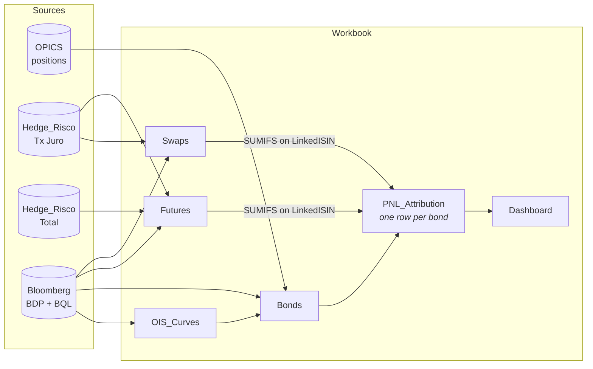
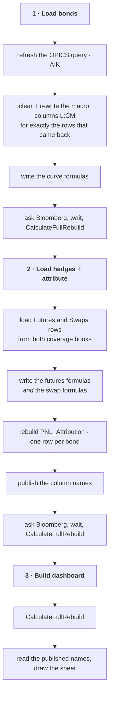
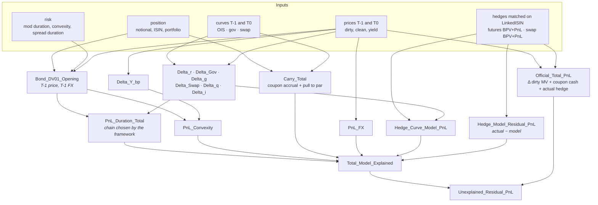
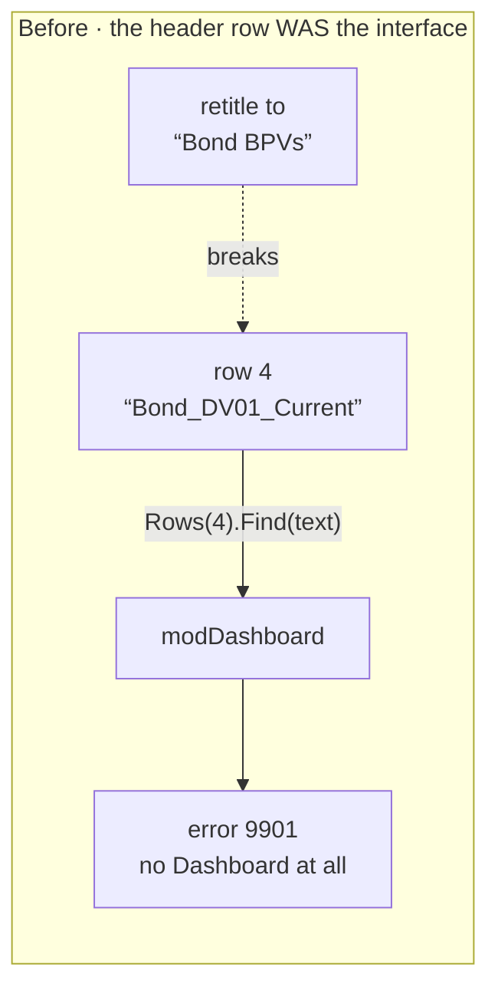
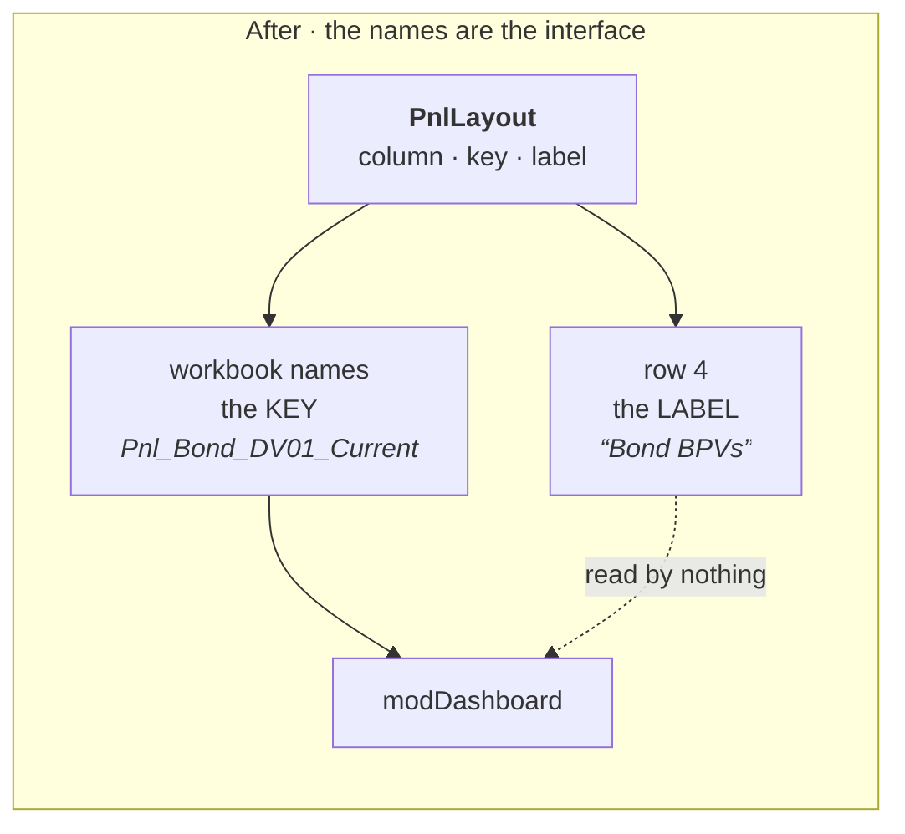
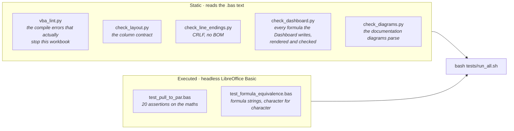

# Architecture

How the workbook is put together, what depends on what, and where to stand when
you want to change something.

- [The shape of it](#the-shape-of-it)
- [The sheets](#the-sheets)
- [The three buttons](#the-three-buttons)
- [Where the numbers come from](#where-the-numbers-come-from)
- [The two interfaces](#the-two-interfaces)
- [The modules](#the-modules)
- [What is checked, and by what](#what-is-checked-and-by-what)
- [Failure modes worth knowing](#failure-modes-worth-knowing)

Related: [BUTTONS.md](BUTTONS.md) · [COLUMNS.md](COLUMNS.md) ·
[DASHBOARD.md](DASHBOARD.md) · [FORMULAS.md](FORMULAS.md) ·
[DECOMPOSITIONS.md](DECOMPOSITIONS.md)

---

## The shape of it

Positions come from OPICS and two hedge coverage books. Market data comes from
Bloomberg, as **live formulas** rather than captured values. Everything in
between is an Excel formula in a cell, so any number on the Dashboard can be
traced back to its inputs by clicking on it.

Two things about that picture are load-bearing.

**PNL_Attribution has one row per bond, and the hedges are aggregated onto it.**
A future or a swap does not get its own attribution row. Its DV01 and its PnL
are summed onto the bond it hedges, by `LinkedISIN`. That is what makes the
bridge close per bond — and it is also why a hedge with a blank `LinkedISIN`
appears on no row at all and is missing from every total. The Dashboard reports
those separately for exactly that reason.

**Nothing is frozen.** The T-1 columns are BQL point-in-time queries dated from
`Config!B4`; the T0 columns are BDP. Re-running reproduces both exactly. There is
no snapshot to capture, no stamp to check, and no un-freeze path to get wrong.

---

## The sheets

| Sheet | Owned by | Holds |
|---|---|---|
| `Config` | you | dates, the base currency, the spread-framework fallback, counts written back by the loaders |
| `Bonds` | query owns `A:K`, macro owns `L:CM` | one row per bond position, its market data and its derived risk |
| `Futures` | macro | one row per futures hedge, from both coverage books |
| `Swaps` | macro | one row per swap hedge |
| `OIS_Curves` | macro | the OIS, government and swap curves, T-1 and T0 |
| `PNL_Attribution` | macro | **the answer** — one row per bond, every leg of the decomposition |
| `Dashboard` | macro | the read-only presentation of `PNL_Attribution` |
| `SpreadOverride` | you | per-ISIN spread-framework overrides |
| `SwapMap`, `CoverageFutures`, `FutMap` | macro | mapping tables built during the hedge load |
| `Coverage support`, `Coverage Total support` | macro | scratch copies of the two coverage books |

The `Bonds` split matters. **The Excel query owns `A:K` and the macro owns
everything from `L` rightwards.** `BONDS_QUERY_LAST_COL` states the boundary and
`LoadOPICS_Bonds` refuses to load if the live query is the wrong width, rather
than misaligning every row. If you add a column to the OPICS query, the boundary
constant has to move with it — see [COLUMNS.md](COLUMNS.md).

---

## The three buttons

There is deliberately no "write formulas" button and no "refresh market data"
button. [BUTTONS.md](BUTTONS.md) explains why, and what moved where.

---

## Where the numbers come from

One bond's row on `PNL_Attribution`, end to end:

Every formula in that picture is written out in full in
[FORMULAS.md](FORMULAS.md), generated from the source. The economics behind the
shape are in [DECOMPOSITIONS.md](DECOMPOSITIONS.md).

---

## The two interfaces

Most of the workbook is ordinary: procedures call procedures. Two boundaries are
different, because they are crossed by *data* rather than by a call, and both
have broken in ways that were invisible until the whole thing stopped.

### 1 · The OPICS query boundary, on `Bonds`

The query writes `A:K`. The macro writes `L` onwards. Nothing enforces this at
runtime except `BondsLayoutIsSane`, which is checked on every load and refuses
rather than misaligning.

### 2 · The column contract, between `modPNL` and `modDashboard`

`modDashboard` needs to find `PNL_Attribution`'s columns. It used to find them
by **searching row 4 for the header text**, which quietly made every string in
that row part of the interface:

Retitling `L4` to `Bond BPVs` — correct, obvious and the right name for the desk
to read — made the search return `Nothing` and killed the entire build before it
drew a cell. Nothing in the sheet could tell you that would happen.

One table declares each column once. The header writer takes the **label** from
it; `PublishPnlColumnNames` publishes the **key** as a workbook name pointing at
the column letter; `modDashboard` uses only the names. Row 4 can now say anything,
in any language, and columns can move.

Full detail and the change procedure: [COLUMNS.md](COLUMNS.md).

---

## The modules

| Module | Exported as | Contains |
|---|---|---|
| `modPNL` | `modPNL_*.txt` | the buttons, the sheet layouts, every formula writer, the PnL model, the curve UDFs |
| `modDashboard` | `Dashboard.txt` | the Dashboard build, and nothing else |
| `modEconFormulas` | `Economic_formula_library.txt` | named builders for the economically meaningful formula strings |
| `modImpRepo` | `ImpRepo.txt` | day counts, accrued interest, coupon schedules, implied repo and basis |

They depend on each other, so importing only some of them will not compile.

The export filenames change (`modPNL_25th_Aug` → `modPNL_26th_Aug` → …). Nothing
in the tooling matches on a filename: `tools/modules.py` identifies each module
by a procedure only it defines, so a rename cannot quietly take the checks
offline — which it had been doing.

### Why `modEconFormulas` exists

A formula that means something economically — a residual, a hedge gap, a
market-value change — is defined **once**, as a builder returning the formula
string, and called wherever that quantity is needed. The alternative is the same
expression typed inline in four places, three of which get updated.

`tests/test_formula_equivalence.bas` pins each builder's output against the
literal the inline code used to produce, character for character, so moving a
formula into the library provably changed nothing. Because the pinned side is
built from the real `PCOL_`/`BCOL_` constants, those cases **also fail when a
column moves** — which is what makes removing a column safe.

---

## What is checked, and by what

There is no Excel here, so the suite works two ways.

`tools/vba_run.py` lifts pure procedures out of the modules and runs them
through LibreOffice Basic for real. That is why the model code is split into a
sheet-facing wrapper and a numeric core: the core touches no worksheet, so it
can be executed and asserted against. Procedures that touch `Range` or
`Worksheet` cannot be run this way and are covered by the static checks only.

Both linters are self-checked — `tests/test_lint_selftest.py` feeds them one
deliberately broken module per diagnostic, plus a clean one that must stay
silent. A linter that quietly stops detecting things is worse than none.

---

## Failure modes worth knowing

These are the ones that do not announce themselves.

**A stale full rebuild.** `InterpOIS`, `InterpGov`, `InterpSwap` and
`BondPullToParPrice` read `OIS_Curves` through the object model, not through cell
references. Excel therefore has **no dependency edge** from a curve cell to the
bonds that use it, and `Application.Calculate` leaves every one of them holding
the previous run's number — silently, and looking entirely plausible. Only
`Application.CalculateFullRebuild` re-evaluates them. Buttons 1, 2 and 3 all do
it; nothing else should need to.

**Asking Bloomberg and not waiting.** BDP and BQL resolve asynchronously.
Recalculating immediately after asking computes the book against
`#N/A Requesting Data`, and the result is not an error — it is blanks, which read
as a *small* PnL rather than a missing one.

**A hedge with no `LinkedISIN`.** It reaches no bond row, so it is in no total.
The Dashboard's quarantine block reports these; without that they simply vanish.

**Two bonds sharing a hedge ISIN.** Each row's `SUMIFS` claims the *full* hedge
PnL and DV01, so it is counted twice. The Dashboard reports rows sharing an ISIN.

**A column that is declared but never filled.** The name resolves, the `SUMIFS`
runs, and the Dashboard reports a confident zero. `check_layout.py` fails on
this now; the one known case is listed in `KNOWN_EMPTY_COLUMNS`.
