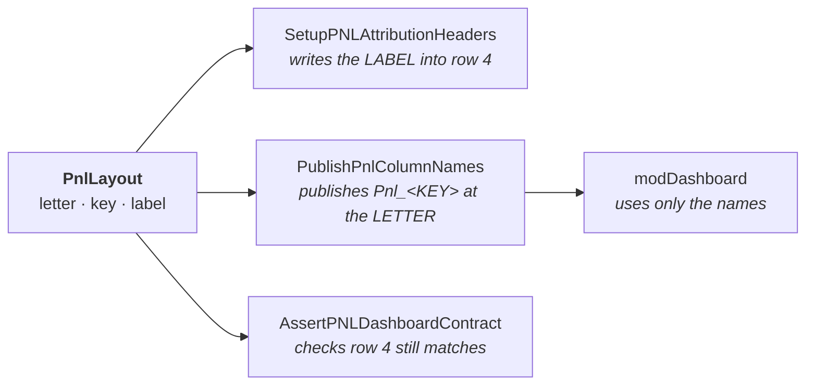

# Columns: how they work, and how to change one

If you only read one section, read [Changing a column](#changing-a-column).

- [The problem this solves](#the-problem-this-solves)
- [Key, label, letter](#key-label-letter)
- [Changing a column](#changing-a-column)
  - [Rename what the desk sees](#1--rename-what-the-desk-sees)
  - [Add a column](#2--add-a-column)
  - [Move a column](#3--move-a-column)
  - [Remove a column](#4--remove-a-column)
- [The other sheets](#the-other-sheets)
- [The OPICS query boundary](#the-opics-query-boundary)
- [What the checks will tell you](#what-the-checks-will-tell-you)

---

## The problem this solves

`modDashboard` has to find `PNL_Attribution`'s columns. It used to find them by
searching the header row for the header text:

```vba
Set f = ws.Rows(4).Find(What:="Bond_DV01_Current", LookAt:=xlWhole)
```

So row 4 was not a row of labels. It was the interface between two modules, and
every string in it was load-bearing — while looking exactly like a row of
labels, which is the kind of thing people quite reasonably retitle.

Retitling `L4` from `Bond_DV01_Current` to **`Bond BPVs`** is the right name for
the desk to read. It made the search return `Nothing`, `DashPnlCol` raise error
9901, and the entire Dashboard build stop before drawing a single cell. Nothing
in the workbook could have told you that would happen.

So the header row is no longer the interface.

---

## Key, label, letter

Every column of `PNL_Attribution` is declared once, in `PnlLayout` in `modPNL`,
as three things:

| | what it is | who reads it | may it change? |
|---|---|---|---|
| **letter** | where the column sits | the formula writers | yes — freely |
| **key** | the name the Dashboard asks for | `modDashboard`, via a workbook name | **only with a matching edit in `modDashboard`** |
| **label** | what appears in row 4 | a human | yes — freely, in any language |

```vba
'                     letter                    key                      label
AddPnlCol spec, PCOL_BOND_DV01_CURRENT, "Bond_DV01_Current",       "Bond BPVs"
AddPnlCol spec, PCOL_HEDGE_DV01,        "Actual_Hedge_DV01",       "Hedge (BPVs)"
AddPnlCol spec, PCOL_DELTA_Y_BP,        "Delta_Y_bp",              "Variação yield bond (bps)"
```

Three consumers read that one table, and nothing else defines these:



`PublishPnlColumnNames` produces, for a book of 208 bonds:

```
Pnl_Bond_DV01_Current   ->   ='PNL_Attribution'!$L$5:$L$212
Pnl_Actual_Hedge_DV01   ->   ='PNL_Attribution'!$N$5:$N$212
```

and `modDashboard` writes `SUMIFS(Pnl_Bond_DV01_Current, ...)`. It contains no
column letter and reads no header text.

> **One thing the contract cannot do for you.** Declaring a column gets it a
> header and a published name. It does **not** put a number in it — that is a
> separate line in `WritePNLRow`. A declared-but-unwritten column resolves
> cleanly and sums to a confident zero, so `check_layout.py` fails on it.

---

## Changing a column

### 1 · Rename what the desk sees

**Edit the label. Nothing else.**

```vba
AddPnlCol spec, PCOL_PNL_FX, "PnL_FX", "Variação cambial (EUR)"
```

Press Button 2. Row 4 updates; every formula, name and Dashboard cell is
untouched. This is the change that used to break everything.

Do **not** change the key to match. The key is the Dashboard's handle on the
column and has no business being readable.

---

### 2 · Add a column

Four edits, in this order.

**a. A column constant**, at the end of the block, with its `' col N` comment
matching the letter:

```vba
Private Const PCOL_PNL_INFLATION As String = "CI"   ' col 87 = PnL_Inflation
```

**b. Extend `PNL_LAST_COL`** if the new column is now the last one:

```vba
Private Const PNL_LAST_COL As String = "CI"
```

`PNL_CLEAR_LAST_COL` reaches past `PNL_LAST_COL` on purpose — it is what stops a
*removed* column leaving a stale header and a stale column of values behind it.
Leave it well clear.

**c. A line in `PnlLayout`**, in sheet order:

```vba
AddPnlCol spec, PCOL_PNL_INFLATION, "PnL_Inflation", "PnL inflação"
```

**d. A writer in `WritePNLRow`** — this is the step people forget, and the one
that produces a confident zero if you skip it:

```vba
ws.Range(PCOL_PNL_INFLATION & p).formula = _
    "=IF(AND(ISNUMBER(" & PCOL_BOND_DV01_OPENING & p & ")," & _
    "ISNUMBER(" & PCOL_DELTA_INFL_BP & p & "))," & _
    "-" & PCOL_BOND_DV01_OPENING & p & "*" & PCOL_DELTA_INFL_BP & p & ",""""))"
```

Then run `bash tests/run_all.sh` and press Button 2.

If the Dashboard should *show* it, add the key to `DashRequiredPnlKeys` in
`modDashboard` and refer to it as `DashN("PnL_Inflation")` or
`DashSumFml("PnL_Inflation")`.

---

### 3 · Move a column

Change the letter in its constant, fix the `' col N` comment, and make sure no
two constants now share a letter. That is all: `PnlLayout` refers to the
constant, the names are published from it, and the Dashboard never saw a letter.

Run `bash tests/run_all.sh`. `check_layout.py` catches a duplicated letter or a
comment that no longer matches, and `test_formula_equivalence.bas` catches a
formula that has quietly started pointing one column left — its pinned side is
built from the real constants, which is precisely what makes moving a column
safe.

---

### 4 · Remove a column

1. Delete the `AddPnlCol` line.
2. Delete the writer in `WritePNLRow`.
3. Delete the constant.
4. Remove the key from `DashRequiredPnlKeys` **and every `DashN(...)` /
   `DashSumFml(...)` that uses it** — `check_layout.py` will list them.
5. Leave `PNL_CLEAR_LAST_COL` where it is. It is what clears the orphaned column
   out of the sheet on the next run.

---

## The other sheets

`Bonds`, `Futures`, `Swaps` and `OIS_Curves` use the same letter constants
(`BCOL_`, `FCOL_`, `WCOL_`, `CVCOL_`) but **not** the key/label separation —
nothing resolves their columns by name, so a header there is only a header.

To add one: declare the constant with a correct `' col N` comment, extend the
relevant header-writer array *and* its range end so the two still agree, and add
a writer. `check_layout.py` enforces:

- no two constants on one sheet sharing a letter (`L001`)
- the `' col N` comment matching the letter (`L002`)
- no unexplained gap in the numbering (`L003`)
- a header array's element count matching its target range width (`L004`)
- Bloomberg writers only touching columns their range builder covers (`L006`)
- no write to a hard-coded letter instead of a constant (`L008`)

`L004` is the one that bites. A block written as

```vba
ws.Range(FIRST & ROW & ":" & LAST & ROW).value = Array(a, b, c, d, e, f, g, h, i)
```

where `FIRST..LAST` spans seven columns and the array has nine elements does not
error — Excel writes seven and drops the rest, and every header after that point
is silently wrong. That is exactly what had happened to `L:R` on this sheet.

---

## The OPICS query boundary

On `Bonds`, the Excel query owns `A:K` and the macro owns `L` rightwards.

```
A ─────────── K │ L ─────────────── CM
   query owns   │      macro owns
                ▲
        BONDS_QUERY_LAST_COL
```

If the query starts returning a different number of columns, `BCOL_DAYSLEFT`
must move to stay immediately after it, and `BONDS_QUERY_LAST_COL` must state
the new boundary. `check_layout.py` (`L005`) enforces that the two agree, and
`LoadOPICS_Bonds` refuses to load when the live table is the wrong width rather
than misaligning every row on the sheet.

---

## What the checks will tell you

```
bash tests/run_all.sh
```

| Message | What it means |
|---|---|
| `PnlLayout declares contract key(s) [...] twice` | the second `Names.Add` overwrites the first; one column silently reads the other |
| `contract key(s) [...] cannot be part of an Excel defined name` | a space or punctuation in a key; `Names.Add` fails and the column is never published |
| `modDashboard asks for PNL column(s) [...] that PnlLayout does not declare` | the name is never published; the build raises 9901 or spills `#NAME?` |
| `PnlLayout declares [...] which WritePNLRow never writes` | published, empty, and reported as a confident zero |
| `modDashboard uses PNL column(s) [...] that DashRequiredPnlKeys does not list` | it will work, but a missing name shows up as a sheet full of errors instead of one message at the top of the build |
| `X is column N, but its comment says col M` | the `' col N` comment drifted; harmless today, misleading tomorrow |
| `header block A..B spans N columns but writes M headers` | `L004` — Excel drops the extras and every header past that point is wrong |
| `N bare LF` | a `.bas` picked up Unix line endings; the VBE imports it as joined lines and it fails to compile somewhere unrelated |

The formula record in [FORMULAS.md](FORMULAS.md) is regenerated with:

```
python3 tools/dump_formulas.py > /tmp/f.md
```

It reads the VBA and evaluates the string concatenation the way VBA would, so it
cannot drift from the code the way a hand-transcribed list does.
