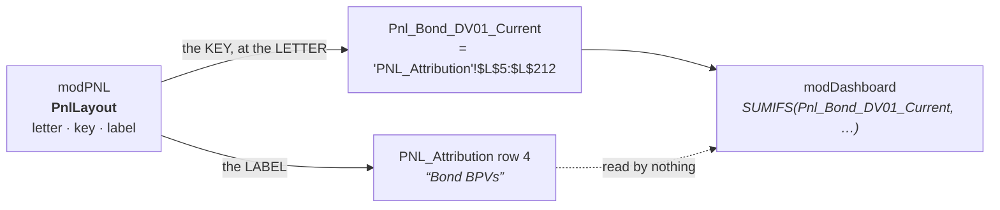
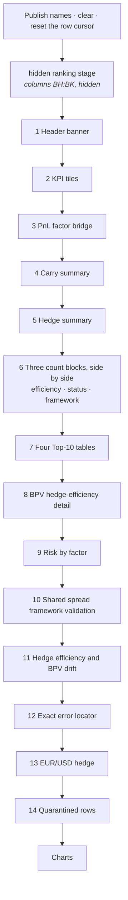

# The Dashboard

What each block is, where its numbers come from, how the sheet is laid out, and
how to change it.

- [What it is](#what-it-is)
- [How it finds its data](#how-it-finds-its-data)
- [The blocks, in build order](#the-blocks-in-build-order)
- [Layout mechanics](#layout-mechanics)
- [Which rows are in which number](#which-rows-are-in-which-number)
- [Changing the Dashboard](#changing-the-dashboard)
- [What is checked](#what-is-checked)
- [The fault map](#the-fault-map)

Related: [ARCHITECTURE.md](ARCHITECTURE.md) · [COLUMNS.md](COLUMNS.md) ·
[BUTTONS.md](BUTTONS.md) · [DECOMPOSITIONS.md](DECOMPOSITIONS.md)

---

## What it is

`modDashboard` reads `PNL_Attribution` and writes one sheet. It computes
nothing: **every cell is a formula over `PNL_Attribution`, so a number on the
Dashboard can always be traced back by clicking on it.** Where a figure could be
recomputed here or read from the attribution, it is read — the two sheets can
then never disagree about the same bond.

It is built by **Button 3**, which does a `CalculateFullRebuild` first. Building
on a stale attribution produces a Dashboard that is internally consistent and
quietly a day old.

---

## How it finds its data

It does not read `PNL_Attribution`'s header row, and it contains no column
letter for that sheet. It refers to columns only as **workbook names** that
`modPNL.PublishPnlColumnNames` publishes from the `PnlLayout` table:



So a column can move, and a header can be reworded in any language, without
touching this module. See [COLUMNS.md](COLUMNS.md).

Two access shapes cover nearly everything:

| Shape | Used for |
|---|---|
| `SUMIFS(Pnl_X, <criteria>)` | every total and KPI |
| `INDEX(Pnl_X, n)` | the per-bond detail tables |

Hedge sheets are different: `Futures` and `Swaps` are addressed by **column
letter** through the `DASH_*_COL` constants, because they have no published
names. Those constants are the only place a letter appears in this module.

---

## The blocks, in build order



| # | Block | Answers | Built by |
|---|---|---|---|
| — | Ranking stage | (hidden) the sort keys the Top-10 tables read | `DashBuildRankStage` |
| 1 | Header banner | which period, built when, is the data newer than the build | `DashBuildHeader` |
| 2 | KPI tiles | the dozen numbers to read first | `DashBuildKpis` |
| 3 | PnL factor bridge | actual vs explained, leg by leg, with tie-outs | `DashBuildFactorBridge` |
| 4 | Carry summary | coupon, pull to par, funding memo | `DashBuildCarrySummary` |
| 5 | Hedge summary | model vs actual hedge PnL, BPV vs target, efficiency | `DashBuildHedgeSummary` |
| 6 | Efficiency / status / framework counts | how many bonds fall in each bucket | `DashBuildEfficiencyBuckets`, `DashBuildStatusSummary`, `DashBuildFrameworkSummary` |
| 7 | Top 10 residuals / FX / hedge / spread | which bonds drive each | `DashBuildTopTable` × 4 |
| 8 | BPV hedge-efficiency detail | per bond: bond BPV, hedge BPV, gap | `DashBuildHedgeEfficiencyDetail` |
| 9 | Risk by factor | what stands against what, and what is open | `DashBuildRiskFactorView` |
| 10 | Shared spread framework validation | per bond: which framework, and does its hedge mix support it | `DashBuildSharedFrameworkView` |
| 11 | Hedge efficiency and BPV drift | per bond: is the hedge the size it should be | `DashBuildHedgeDriftView` |
| 12 | Exact error locator | per bond: one diagnostic code, and whether it is in the totals | `DashBuildErrorLocator` |
| 13 | EUR/USD hedge | exposure, cover, both PnL legs, the net | `DashBuildFxHedgeView` |
| 14 | Quarantined rows | what was excluded, why, and what it was worth | `DashBuildQuarantineView` |

### The bridge, and why it ties

The bridge is the block to trust or distrust everything else by. It ends in two
tie-out lines that must both read zero:

```
Check: components - Total Explained      (want 0)
Check: Explained + Residual + Not attributed - Actual   (want 0)
```

The second holds by construction — `Unexplained_Residual_PnL` is
`Official − Explained` per row. The first holds only if every component line is
summed over the same rows as the total, which is what
[the criteria](#which-rows-are-in-which-number) below are for.

The **FX hedge** line is a book-level position with no bond row of its own, so
it is added to both the Explained line and the Actual line by the same amount —
the tie-outs are unaffected, and the book's actual PnL includes the contracts
that cancel the bond side's FX translation.

### Risk by factor, and why the bond BPV splits the way it does

A bond is exposed to every factor at once: `y = r + g + q + i`, so the same DV01
sits behind all of them. What can be split is not the exposure but the **hedge**,
and with it the share of the bond's BPV each hedge stands against:

```
coverage = min(1, |hedge| / |bond|)        how much of the bond is hedged
share_f  = |futures| / |hedge|             how that cover splits
share_s  = |swaps|   / |hedge|

futures row    bond BPV = bond × coverage × share_f
swaps row      bond BPV = bond × coverage × share_s
unhedged row   bond BPV = bond × (1 − coverage)
```

The three add back to the book's BPV exactly, and their hedge column adds back
to `Actual_Hedge_DV01`, so the Total line is a genuine check on the three above
it. A well-hedged bucket nets to ~0; an over-hedged one nets negative, which is
the honest answer. The unhedged row carries no control, because open risk is a
position, not an error.

The swap breakdown by float index sits **below**, separated, as an inventory: it
is taken off the `Swaps` sheet in full, including the swaps of quarantined
bonds, so it does not tie to the swap-curve line and must not look as though it
should.

---

## Layout mechanics

Blocks flow down the sheet. Nothing is at a fixed row except the header and the
KPI band.

**`dashRowCursor`** is a module-level cursor. Each block writes from the row it
is given and sets the cursor to its last row; the next block starts at
`dashRowCursor + 2`. It is reset to 0 at the start of every build rather than
inheriting wherever the previous one finished.

Three count blocks sit **side by side** in columns A, D and G. They share a top
row and each advances the cursor only if it is the tallest, so a long list of
attribution statuses cannot push the framework table into it.

The **ranking stage** is four hidden columns from `DASH_STAGE_FIRST_COL` (BH),
one per Top-10 table. Each holds `ABS(metric) − n × 1e-9` for every source row,
or a sentinel far below any real PnL for rows that should not rank. The tiny
`n`-dependent term breaks ties so `LARGE()` never returns the same row twice.
`DashClear` wipes the whole sheet, so a stage sized for a longer book cannot
leave stale keys behind.

`DashClear` deletes every shape **except** those whose name starts with
`DASH_BUTTON_PREFIX`, so the buttons survive a rebuild.

---

## Which rows are in which number

Four criteria strings, and picking the wrong one is how a bridge stops tying.

| Helper | Rows | Use for |
|---|---|---|
| `DashDetailCriteria` | real ISIN, not `TOTAL`, **`Row_Valid = 1`** | every headline total |
| `DashAttributedCriteria` | the above **and** `Total_Model_Explained` is numeric | the bridge's component lines |
| `DashQuarantineCriteria` | real ISIN, not `TOTAL`, **`Row_Valid = 0`** | the quarantine block |
| `DashValidMask` | the same filter as an array, `--(N(Pnl_Row_Valid)=1)` | `SUMPRODUCT`, where `SUMIFS` cannot express the weighting |

`DashDetailCriteria` and `DashQuarantineCriteria` **partition** the detail rows
exactly: anything dropped from the totals appears in the quarantine block, and
nothing is counted twice.

> A component summed over all rows, but compared against a total built only from
> rows that fully attributed, cannot add up. The difference is the components of
> the rows that dropped out — which looks like a broken model when it is missing
> data. Every line of the bridge must use `DashSumAttributedFml`.

The per-bond **detail tables list every row, quarantined ones included** — the
Error Locator is where a reader goes to find out *why* a bond was dropped, so
hiding the dropped ones would defeat it. Its "In Totals" column says which is
which.

---

## Changing the Dashboard

### Show an existing PNL column

It must be declared in `PnlLayout` (it will be, if it is on the sheet) and
listed in `DashRequiredPnlKeys` — that list is what
`DashValidateSourceHeaders` touches at the top of the build, so a missing name
is reported once by key instead of as a sheet full of `#NAME?`.

Then use it:

```vba
DashLabelledFormula ws, r, "Inflation PnL", _
    "=" & DashSumFml("PnL_Inflation"), "#,##0": r = r + 1
```

| Helper | Gives you |
|---|---|
| `DashN(key)` | the name — `Pnl_PnL_Inflation` |
| `DashSumFml(key)` | `SUMIFS` over the rows in the totals |
| `DashSumAttributedFml(key)` | the same, restricted to rows that attributed — **use this in the bridge** |
| `DashSumQuarantinedFml(key)` | the same, over the quarantined rows |
| `DashIndexCell(key, n)` | the n'th row's value, for a detail table |
| `DashSafeDiv(a, b)` | a ratio that is blank rather than `#DIV/0!` |

### Add a block

1. Write `Private Sub DashBuildXxx(ByVal ws As Worksheet, ByVal startRow As Long)`.
2. Write your header at `startRow`, your column titles at `startRow + 2`, your
   rows from `startRow + 3`.
3. **End with `dashRowCursor = <your last row>`.** Forget this and the next
   block writes on top of yours.
4. Call it from `BuildDashboard_Step6` with `dashRowCursor + 2`, and set
   `buildStage` first so a failure names your block.

### Add a Top-10 table

`DASH_STAGE_COLS` is how many ranking keys there is room for. Add your metric to
the `metrics` array in `DashBuildRankStage`, raise `DASH_STAGE_COLS`, then call
`DashBuildTopTable` with the new key's index.

### Change the row cap on the quarantine listing

`DASH_QUARANTINE_MAX`. The block's totals come from `PNL_Attribution`, not from
the listing, so a capped list still reports the whole amount — and it says how
many more there are.

### After any change

```
bash tests/run_all.sh
```

`tools/check_dashboard.py` renders every formula the module writes and checks
it. It is the difference between finding a bracket fault now and finding it when
the build stops in front of the desk.

---

## What is checked

`tools/check_dashboard.py` runs the build procedures through
`tools/vbaeval.py` — a small VBA interpreter — and checks each of the ~12,000
formulas that come out:

| | |
|---|---|
| `D001` | unbalanced brackets |
| `D002` | a name that is never published, so the cell is `#NAME?` |
| `D003` | a hedge-sheet column that does not exist on that sheet |
| `D004` | a `SUMIFS` whose criteria do not pair up, or whose ranges are different lengths |
| `D005` | a bare column letter with no row — reads as an undefined name |
| `D006` | a formula Excel will not accept: too long, empty, a dangling operator |
| `D007` | a formula the renderer could not evaluate at all |

It interprets rather than pattern-matches because most of these formulas are
assembled into a variable a dozen lines before they are written — evaluating the
`.formula =` expression on its own resolves almost none of them.

```
python3 tools/check_dashboard.py           # check
python3 tools/check_dashboard.py --list    # print every rendered formula
```

---

## The fault map

What was found in the audit that produced this document, and what was done. Kept
because each one is a category, and the categories recur.

### Stopped the build outright

**The quarantine block's formula was one bracket short.** `FILTER` was never
closed before `INDEX`'s position argument, so the position landed inside
`FILTER` as its `if_empty` and `INDEX` was left with one argument:

```excel
=IFERROR(INDEX(FILTER(Pnl_ISIN,(Pnl_Row_Valid=0)*(Pnl_ISIN<>""),1),"")     wrong
=IFERROR(INDEX(FILTER(Pnl_ISIN,(Pnl_Row_Valid=0)*(Pnl_ISIN<>"")),1),"")    right
```

Excel rejects an invalid formula on assignment with run-time error 1004. So this
did not produce bad cells — it **aborted the build at that block**, and every
block after it was never drawn. `D001` exists because of this one.

**`DashClear` deleted the buttons on every build.** It spared one shape named
`btnBuildDashboard6`, from before the three-button remake. Shapes are now kept
by name prefix, so a fourth button cannot reintroduce it.

### Produced confident nonsense

**The Risk by Factor view said REVIEW on every row.** Its Bond BPV column was
the literal string `"0"`, so Net BPV was just the hedge BPV, and the Control
column — which asks whether the net is small beside the two sides — compared a
hedge against itself. Rebuilt as the coverage/share allocation above, with a
tie-out.

**The Snapshot banner was permanently wrong.** It read `Config!B49`, the T0
freeze stamp. Nothing freezes anything now, so it said "T0 not frozen" on every
build for ever, beside advice to press a button that no longer exists. A
permanent warning is not a warning. It now reads `Config!B24` — when market data
was last refreshed — which is the one staleness the desk can act on.

### Stale after the button remake

The run-order banner said "Run PNL calculation (Button 5)"; the empty-sheet
message said "Run Button 5 first"; the status bar said "Button 6" throughout.
All now name the buttons that exist.

### Wasted the reader's time

The quarantine listing reserved one row per bond, so two quarantined names were
followed by two hundred blank bordered rows. Capped, with a line saying how many
more are in the total.

### Fixed earlier, kept here because they are the same categories

- The risk view summed `Swaps!X`, the orphaned model DV01, where every other
  table uses `Swaps!BN` — two numbers for one quantity.
- `DashFrameworkWeightFml` interpolated bare column letters, so
  `MIN(E,MAX(...))` read `E` as an undefined name and all three weight columns
  were `#NAME?`.
- The book-weight KPIs were `SUMPRODUCT`s over *all* rows while everything above
  them was filtered, so they described a different book.
- The median hedge-efficiency tile used `AGGREGATE(17,…)` — `QUARTILE.INC`,
  whose last argument is a quartile 0–4 — so any book over eight rows returned
  `#NUM!` and `IFERROR` displayed it as blank. The tile looked empty rather than
  wrong.
