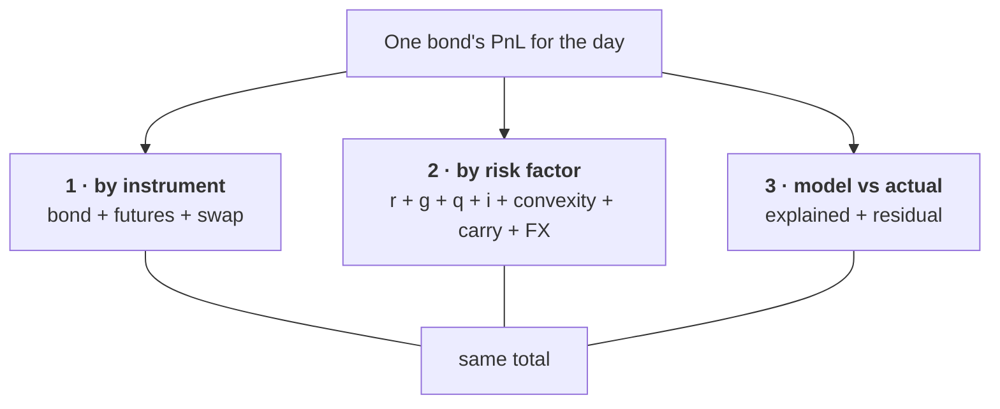
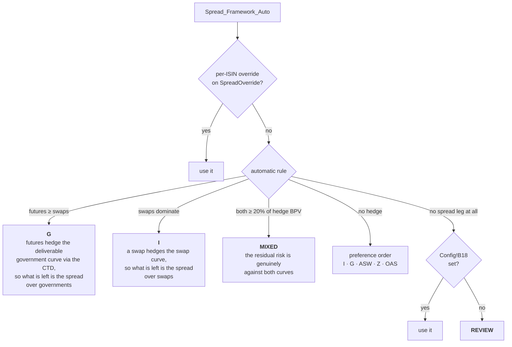
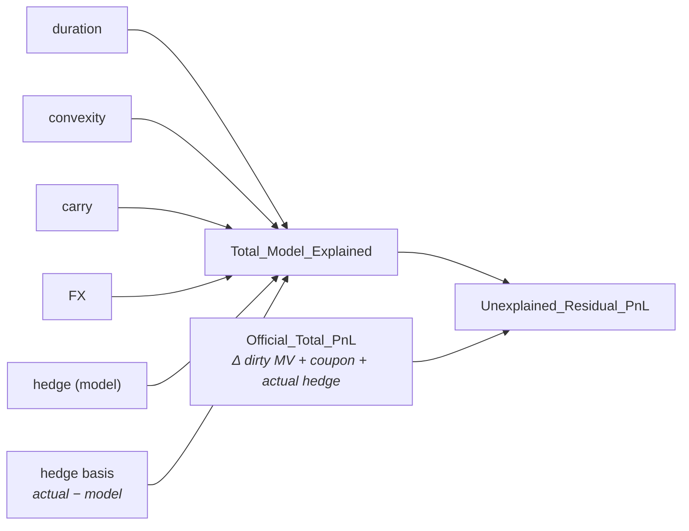

# Three ways to decompose the PnL

The book is bonds, bond futures and interest-rate swaps. There are three
independent ways to cut its PnL, and the workbook computes all three from the
same row. They answer different questions and they are not alternatives — you
need all three to know whether a number is right.

| | Question | Cuts by | Ties to |
|---|---|---|---|
| **1 · By instrument** | *Who* made the money? | bond leg, futures leg, swap leg | the book total, exactly |
| **2 · By risk factor** | *What* made the money? | rate, basis, credit, convexity, carry, FX | the same book total, exactly |
| **3 · Model vs actual** | Do we *understand* the money? | theoretical, explained, residual | itself, by construction |



Every formula referenced here is written out in full in
[FORMULAS.md](FORMULAS.md), generated from the source.

---

## 1 · By instrument

The simplest cut, and the one the desk recognises: what each leg of the position
actually earned, from marks and cash only. No model.

```
bond leg     = Δ(dirty market value, EUR) + coupon cash received
futures leg  = Σ contracts × multiplier × Δ(futures price) × FX
swap leg     = Δ(swap NPV, EUR)
────────────────────────────────────────────────────────────────
book         = bond + futures + swap
```

On the sheet:

| Leg | Column | Built from |
|---|---|---|
| bond | `Delta_Dirty_MV_EUR` + `Coupon_Paid_EUR` | `Bonds!DirtyMV_T0_EUR` − `DirtyMV_T-1_EUR`, `SumCouponsBetween` |
| futures | `Actual_Futures_PnL` | `SUMIFS` over `Futures!FuturesPnL_EUR` on `LinkedISIN` |
| swaps | `Actual_PlainSwap_PnL` | `SUMIFS` over `Swaps!PnL` on `LinkedISIN` |
| total | `Official_Total_PnL` | the three above |

**Why the coupon term is there.** Official PnL is built from the change in
*dirty* market value, and dirty value carries accrued interest. On a coupon date
accrued resets to zero, so the dirty value drops by the whole coupon while the
desk's cash rises by the same amount. Without the cash term the drop is booked as
a loss and the cash is booked nowhere — the bond's residual opens by exactly one
coupon, on ex-dates and only on ex-dates, which reads like a model failure and
is a missing cash flow.

**Why the hedges are aggregated onto the bond row.** A future or a swap has no
row of its own on `PNL_Attribution`; its PnL is summed onto the bond it hedges
via `LinkedISIN`. That is what lets each row close its own bridge. The cost is
two failure modes, both reported on the Dashboard rather than left to be found:

- a hedge with a **blank or unmatched `LinkedISIN`** reaches no row and is in no
  total;
- **two bonds sharing a hedge ISIN** each claim the full hedge PnL and DV01, so
  it is counted twice.

### Separately, then compared

The Dashboard shows each leg on its own line and then the comparison that
matters — model against actual, per leg:

```
Futures_Gov_Model_PnL       what the futures SHOULD have made, from their DV01
Actual_Futures_PnL          what they DID make
Futures_Model_Residual_PnL  the difference — the CTD / delivery-option basis

Swap_Curve_Model_PnL        what the swaps SHOULD have made
Actual_PlainSwap_PnL        what they DID make
Swap_Model_Residual_PnL     the difference — swap spread mismatch
```

Those two differences are real economics, not error. A futures hedge tracks the
CTD, not the bond; a swap hedges the swap curve, not the bond's curve. The gap
is the **basis**, and a desk running a cross-instrument hedge is paid to watch
it.

---

## 2 · By risk factor

The same total, cut by what moved instead of by what held it.

### The identity everything rests on

```
y = r + g + q + i
```

| term | definition | meaning |
|---|---|---|
| `y` | bond yield to maturity | what the bond yields |
| `r` | OIS zero rate at the bond's tenor | the risk-free rate |
| `g` | `Gov − OIS` | sovereign / collateral basis |
| `q` | `Swap − Gov` | swap / government basis |
| `i` | `y − Swap` | the bond's own I-spread |

Every term is a **difference of two quoted rates**, so the chain telescopes
exactly. That is the whole reason several frameworks can split the same yield
move differently and still produce the same total.

### The legs

```
duration    = −D × Δy          split into r / g / q / i by the framework
convexity   = ½ × MV × C × (Δy/10 000)²
carry       = coupon accrual + pull to par
FX          = opening local exposure × ΔFX
hedge       = −(hedge DV01) × Δ(the curve that hedge neutralises)
```

with `D` = `Bond_DV01_Opening` and `MV` = `DirtyMV_T-1_EUR`.

> **Both are struck at T-1, and they have to be.** `Bond_DV01_Current` is the
> risk the book carries *now* — the right number for a hedge ratio or a coverage
> weight, the wrong one to attribute yesterday's move to. And in
> `ΔP = −DV01·Δy + ½·MV·C·Δy²` the **plus** on convexity is only correct when
> both terms are anchored at the *start* of the move; anchored at the end it
> flips sign. Mixing the two anchors adds the convexity when it should be
> subtracting it. `Risk_Timing_Bias` reports, per bond, what the choice is worth.

### The framework chains

A framework decides how `−D·Δy` is split. It never changes the total.

| code | chain | ties |
|---|---|---|
| `G` | `−D·Δr − D·Δg − D·Δ(G-spread)` | **exactly** |
| `I` | `−D·Δr − D·Δg − D·Δq − D·Δi` | **exactly** |
| `ASW` | `−D·Δr − D·Δg − D·Δq − D·Δ(ASW)` | approximately |
| `Z` | `−D·Δr − D·Δg − D·Δq − D·Δ(Z-spread)` | approximately |
| `OAS` | `−D·Δr − D·Δg − D·Δq − D·Δ(OAS)` | approximately |
| `OIS` / `SOFR` | `−D·Δy`, undecomposed | trivially |
| `MIXED` | DV01-weighted blend of the `G` and `I` chains | approximately |
| `REVIEW` | attribution suppressed | — |

`G` and `I` tie **exactly**, because G-spread and I-spread are *defined* as
differences from the same yield. `ASW`, `Z` and `OAS` are quoted on their own
conventions — against a floating leg, against the whole zero curve, after
stripping optionality — so a small standing difference is expected there.

`Duration_Identity_Check` is `PnL_Duration_Total − (−D·Δy)`. **Read it as data
quality, not model quality.** Non-zero on a `G` or `I` row means a curve leg is
stale or T0 and T-1 came from different snapshots.

### How a bond's framework is chosen



Three things about that rule are deliberate:

**`Config!B18` is a fallback, not an override.** It used to sit *ahead* of the
automatic rule, which made it a blanket override: setting it for one problem bond
silently re-based every other bond in the book onto that curve — including the
futures-hedged ones, whose residual risk is against governments — and switched
off `MIXED` entirely. A global cell cannot know a per-bond fact. Per-bond
corrections belong on `SpreadOverride`.

**Dominance is measured on absolute DV01**, so it does not depend on the sign
convention of either hedge leg.

**Synthetic swaps do not vote.** A synthetic is the hedge the desk *could* have
put on, not the one whose risk is in the book. Letting it choose the framework
would measure the bond against a curve it is not exposed to.

### Carry, and what is not in the bridge

```
Carry_Coupon      notional × coupon × yearfrac × FX_T-1        smooth accrual
Carry_RollToPar   arbitrage-free forward repricing              pull to par
Carry_Total       the two above
────────────────────────────────────────────────────────────
Funding_Carry_Memo                                             NOT in the bridge
```

Pull to par is priced on the **forward** curve, not by repricing on the spot
curve at a shorter maturity — that would book the whole roll-down of an
upward-sloping curve as PnL the desk never earned:

```
(1 + f(h,t))^(t−h) = (1 + y(t))^t / (1 + y(h))^h
```

Coupons paid inside the horizon drop out on purpose; they are already reported by
`Carry_Coupon`, and counting them twice is the easiest way to double the carry
leg.

Funding is economic carry, not mark-to-market. `Official_Total_PnL` is a
mark-to-market total with no financing leg, so putting funding *in* the bridge
would open a residual exactly equal to it. It is shown beside the bridge.

### FX, on a EUR/USD hedged book

The currency PnL arrives in two places that only mean something together:

```
bond side    opening local exposure × ΔFX          →  PnL_FX
hedge side   PnL of the EUR/USD contracts          →  Futures rows, Hedge_Class = FX
────────────────────────────────────────────────────────────────────────────────
net          the two summed — what the hedge actually cost or earned
```

A large FX line on the bond side is not a currency call the desk took; it is half
of a hedge whose other half sits on the `Futures` sheet. Only the **net** is a
result. `Futures!Hedge_Class` is what separates the EUR/USD contracts from the
bond futures, so their notional is never added to a bond's *rates* hedge.

---

## 3 · Model vs actual — the bridge

The third cut is not a split of the total. It is the comparison of two
independently computed totals, and it is how you find out whether the first two
are trustworthy.

```
practical  = Δ(dirty MV, EUR) + coupon cash + actual hedge PnL      what happened
theoretical= duration + convexity + carry + FX + model hedge         what should have
explained  = theoretical + hedge basis
residual   = practical − explained                                   what we cannot say
```



### Why the hedge basis sits inside `explained`

`practical` contains the **actual** hedge PnL. Adding the basis back makes the
hedge leg of `explained` telescope to that same actual figure:

```
model hedge + (actual hedge − model hedge) = actual hedge
```

so the bridge closes by construction and the residual isolates **bond-leg model
error** — which is what "unexplained" ought to mean. Leave the basis out and the
futures/CTD basis and the swap spread mismatch land in the residual *every single
day*, however good the model is. The basis is still reported on its own line.

### What a residual actually tells you

| Residual | Likely cause |
|---|---|
| ~0 | the model explains the day |
| one coupon, on an ex-date | a missing coupon-cash term |
| a standing small % on `ASW`/`Z`/`OAS` rows | those spreads are quoted on their own conventions |
| large and one-sided across the book | a curve leg is stale, or T0 and T-1 are from different snapshots |
| large on one bond | that bond's data — check `Attribution_Status` and `Row_Exclusion_Reason` |

### The snail trail

Plot cumulative **theoretical** against cumulative **practical**, day by day. A
model with no bias produces a cloud around the 45° line. A model with a bias
produces a curve that walks away from it — the "snail" — and the direction says
which leg is wrong.

The test that matters is not "is the mean residual small" but "is it small
*relative to its own standard error*": a mean residual of €2k on 200 days with a
€40k daily standard deviation is noise; the same €2k with a €3k standard
deviation is a bias. That is a t-statistic against `std/√n`, not against `std`.

### Rows that cannot bridge

A bond whose attribution does not compute is **quarantined**: `Row_Valid = 0`,
with the reason in `Row_Exclusion_Reason`, and excluded from every total on the
Dashboard.

This is not tidiness. A bond that contributes a number to some legs and a blank
to others makes each line of the bridge a sum over a *different* set of bonds, so
the bridge cannot tie — which reads as a broken model when it is one broken row.
A quarantined bond takes its hedges with it, because they are aggregated onto the
same row. Nothing is hidden: the block at the bottom of the Dashboard names every
dropped bond, its reason, and the PnL of the hedges that went with it.

**Being badly hedged is not grounds for exclusion.** Over-hedged,
wrong-direction and high-residual are real, fully computed states of the book.
They stay in the totals and stay flagged in `Attribution_Status`.

---

## What the model cannot see

Stated here because they are structural, not bugs to be fixed locally.

**There is no T-1 position snapshot.** Positions come from a single OPICS pull of
*today's* book, and `DirtyMV_T-1` is today's notional at yesterday's price. So a
position opened during the period has its whole change in MV attributed to market
moves; a position closed during the period is absent from the query and its
realised PnL is missing from every total; an intraday size change is
mis-attributed in proportion to the change. Fixing this needs a second, dated
position pull — not a formula change.

**Hedges are matched to bonds by ISIN only.** See the two failure modes in
[section 1](#1--by-instrument).

**The price/FX cross term is in the residual.** With the rate legs struck at
FX_T-1 and the actual MV change translated at FX_T0, the difference
`Δprice × ΔFX` lands in the residual. It is genuinely second order and that is
where it belongs, but on a large FX move it is visible.
