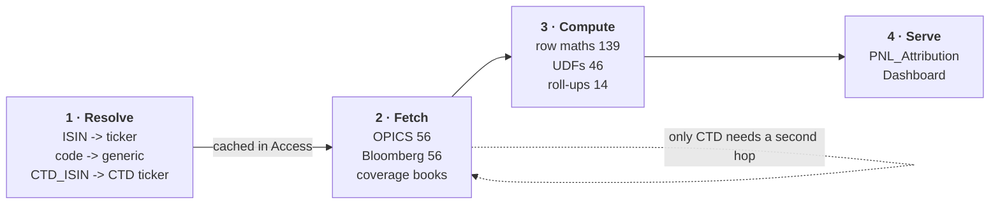

# The pipeline: what is fetched, what is computed, and in what order

Excel fetches. Access stores and computes. Excel displays.

This works out where the line actually falls — which of the 330 columns are
**inputs** that only Excel can obtain, which are **transformations** of data
already in hand, and what has to happen before what.

Every number below is derived by `tools/classify_columns.py` from the module
itself, not transcribed. Re-run it after any change; the raw table is in
[`analysis/column_sources.csv`](analysis/column_sources.csv).

- [The answer in one table](#the-answer-in-one-table)
- [Stage 1 — resolve identities](#stage-1--resolve-identities)
- [Stage 2 — fetch the inputs](#stage-2--fetch-the-inputs)
- [Stage 3 — compute, in Access](#stage-3--compute-in-access)
- [Do the stages really depend on each other?](#do-the-stages-really-depend-on-each-other)
- [What the transformations actually are](#what-the-transformations-actually-are)
- [The Dashboard and PNL_Attribution sheets](#the-dashboard-and-pnl_attribution-sheets)
- [Three things the analysis found](#three-things-the-analysis-found)

Related: [ACCESS_ARCHITECTURE.md](ACCESS_ARCHITECTURE.md) (the store) ·
[DECOMPOSITIONS.md](DECOMPOSITIONS.md) (the economics)

---

## The answer in one table

| Sheet | Bloomberg | Query | UDF | Aggregate | Derived | Unwritten | Total |
|---|---|---|---|---|---|---|---|
| Bonds | 17 | 11 | 22 | — | 30 | 9 | 89 |
| Futures | 10 | 18 | — | 1 | 11 | 2 | 42 |
| OIS_Curves | 18 | 9 | 12 | — | 3 | 4 | 46 |
| PNL_Attribution | — | — | 7 | 13 | 65 | 1 | 86 |
| Swaps | 11 | 18 | 5 | — | 30 | 3 | 67 |
| **Total** | **56** | **56** | **46** | **14** | **139** | **19** | **330** |

**112 columns are fetched. 199 are computed.**

The 199 are the prize. Every one of them is a pure function of columns already
on a sheet, so every one can be evaluated once in Access instead of being held
as a live formula in every row of the workbook.

**`PNL_Attribution` has no fetched columns at all** — all 86 are derived from
`Bonds`, `Futures`, `Swaps` and `Config`. It is a pure output sheet, which is
exactly why it is the one to serve from Access.

> The 19 "unwritten" are columns the constants declare and nothing fills. They
> are not a bug in the classifier — `Bond_DV01_Credit_Spread` is one, and the
> existing formula dumper independently reports it as *"not written by
> WritePNLRow"*. They are the columns to resolve before the schema is frozen.

---

## Stage 1 — resolve identities

**This is the stage that is easy to miss, and it is a Bloomberg round-trip of
its own.** You cannot ask Bloomberg for a price until you know what to call the
thing, and what to call it is itself a question for Bloomberg.

For a bond, the workbook builds ten candidate security ids from the ISIN —
`XS123…`, `/isin/XS123…`, `XS123… Corp`, `@BVAL Corp`, `@BGN Corp`, `Govt`,
`@BVAL Govt`, `@BGN Govt`, `Mtge`, `M-Mkt` — as plain strings, then resolves
them by asking Bloomberg which one parses:

```excel
=IFERROR(BDP(cand1,"PARSEKYABLE_DES"),
  IFERROR(BDP(cand2,"PARSEKYABLE_DES"), ... "UNKNOWN"))
```

Lazily evaluated, so a bond whose first candidate resolves costs one probe and
one whose tenth does costs ten. Either way **it is re-asked for every bond on
every run**, and the answer — which Bloomberg ticker corresponds to an ISIN —
essentially never changes.

Four identities have to be resolved before anything can be priced:

| Identity | Resolved from | Resolved by |
|---|---|---|
| Bond BBG ticker | ISIN (OPICS) | up to 10 `BDP(...,"PARSEKYABLE_DES")` probes |
| Futures generic ticker | OPICS contract code | the `FutMap` lookup sheet |
| CTD ticker | `CTD_ISIN` (OPICS futures query) | string build + `BDP` |
| Swap security id | Hedge Risco deal ids | string build (`… Corp`) |

**In the Access design, stage 1 becomes a cache.** `Instrument.BBG_Ticker` is
resolved once and stored; a run probes Bloomberg only for ISINs the database has
never seen. On a book whose composition changes by a handful of bonds a day,
that removes essentially all of the ticker-resolution traffic — and it converts
a per-run cost into a per-*new-instrument* cost.

It also makes the failure legible: an ISIN that never resolves is a row in
`Instrument` with a null ticker and a date, not a `"UNKNOWN"` that reappears
silently every morning.

---

## Stage 2 — fetch the inputs

112 columns, from three sources. This is everything that must pass through
Excel or a query, and once it is in Access **no further Bloomberg call is
needed for the rest of the run.**

### From OPICS (SQL, 56 columns)

Positions and static. `Bonds!A:K` is written by the Excel query table itself;
the futures and swaps come through ADO recordsets.

- bond: ISIN, name, CCY, coupon, coupon frequency, maturity, notional,
  accounting category, portfolio, book value
- futures: contract code, exchange, face value, delivery date, **CTD_ISIN**,
  conversion factor, average entry price
- swaps: deal id, dates, PayFixed, counterparty, portfolio

`CTD_ISIN` is the one to note: it is an OPICS field that becomes a *Bloomberg
input* in stage 2b, which is why the futures chain has an extra step.

### From the coverage books (Hedge Risco, part of the 56)

The `#RC` relation, the covered ISIN, the instrument label, notional, start
date, currency, BPV. Copied values-only into a staging sheet and mapped.

**These must be captured raw** — the books are overwritten in place by the desk,
so a run is the only chance to record what they said.

### From Bloomberg (56 columns)

| Block | Fields |
|---|---|
| Curves (18) | OIS / Gov / Swap par rates, T‑1 and T0, three currencies × 13 tenors |
| Bond market (17) | clean, dirty, accrued, YTM, mod duration, convexity, Z-spread, ASW, OAS, OAS duration, OAS convexity, pricing source, day count, FX |
| Futures (10) | futures price T‑1/T0, CTD dirty price, `FUT_VAL_PT`, implied repo, net and gross basis |
| Swaps (11) | BQL NPV (direct / fixed leg / float leg), T‑1 and T0, DV01, `PAY_FLT_RATE_IDX` |

Two snapshots of everything: **T‑1 via BQL point-in-time, T0 via BDP.** Both are
reproducible from `Config` dates, which is why nothing needs freezing.

### The one ordering constraint inside stage 2

Almost all of it can be asked at once — and the workbook does exactly that,
firing one refresh and then waiting per section. There is only one genuine
sequence:

> **`CTD_ISIN` (OPICS) → CTD ticker → CTD dirty price → implied repo / gross
> basis.** The futures basis cannot be computed until the cheapest-to-deliver
> bond has been priced, and which bond that is comes from OPICS.

Everything else within stage 2 is parallel.

---

## Stage 3 — compute, in Access

Once stage 2 is stored, **nothing else needs Bloomberg.** The remaining 199
columns are transformations, and they split into three kinds.



---

## Do the stages really depend on each other?

Yes, and the dependency is strict in one direction only.

**Stage 1 → 2 is a hard barrier.** No ticker, no price. This is the only place a
Bloomberg call depends on the *result* of another Bloomberg call, and it is why
resolution deserves to be a separate, cached step rather than being tangled into
the price formulas as a fallback chain — which is what it is today.

**Stage 2 → 3 is a hard barrier**, and a useful one: it is the point at which
the run stops needing Bloomberg, Excel, or the network. Everything after it is
arithmetic over stored values, which means it can be re-run, audited, corrected
and back-tested without re-fetching anything.

**Inside stage 3 there is a strict order**, and it is the economics:

| Wave | Computes | Needs |
|---|---|---|
| 3a | curve derivatives — `g = Gov − OIS`, `q = Swap − Gov` | curve pulls |
| 3b | bond derived spreads — I-spread, G-spread, DV01, spread duration | bond pulls + 3a |
| 3c | hedge economics — futures DV01 (CF × CTD), swap DV01, hedge PnL | futures/swap pulls + CTD price |
| 3d | **hedge roll-up per bond** — the `SUMIFS` today | 3c |
| 3e | attribution — the decomposition chain, carry, FX, residual | 3b + 3d |
| 3f | quarantine and status — `Row_Valid`, `Attribution_Status` | 3e |
| 3g | book aggregates — the Dashboard's totals | 3e + 3f |

Wave 3d is the one worth moving first. It is 14 aggregate columns computed as 15
whole-column `SUMIFS`/`COUNTIFS` **per bond row**, and in Access it is a single
indexed `GROUP BY` over the hedge table.

Waves 3e and 3f are why the attribution has to run *after* the roll-up rather
than beside it: `Hedge_DV01_Gap`, `Hedge_Ratio` and `Hedge_Efficiency` all read
the rolled-up hedge DV01, and `Row_Valid` reads the result of the whole chain.

---

## What the transformations actually are

The 199, by kind.

**139 derived** — arithmetic and logic over columns on the same row.

| Pattern | Example |
|---|---|
| A difference | `Delta_g_bp = (g_T0 − g_T‑1) × 10000` |
| A guarded difference | `IF(AND(ISNUMBER(a),ISNUMBER(b)), a−b, "")` |
| A product | `PnL_OIS = −DV01_Opening × Delta_r_bp` |
| A currency conversion | `DirtyMV_EUR = DirtyPx × Notional / 100 × FX` |
| A copy across sheets | `PNL_Attribution!Name = Bonds!Name` |
| A selection | `SpreadPnL_Used = SWITCH(framework, "G", PnL_GSpread, …)` |
| A classification | `Spread_Framework_Auto`, `Hedge_Class` |
| A status string | `Attribution_Status`, `Row_Exclusion_Reason` |

All of it is `SELECT` expression territory — the `IF(AND(ISNUMBER…))` guards
become `IIF(a IS NOT NULL AND b IS NOT NULL, …)`, and they get *simpler*,
because a database has nulls and a spreadsheet has `""`.

**46 UDF-derived** — the VBA functions cells call: `InterpOIS`/`Gov`/`Swap`,
`BondPullToParPrice`, `BondSpreadTMinus1`, `AccruedInterest`, `NextCouponDate`,
`ImpliedRepoBloomberg`, the day-count and float-index mappings.

These are the ones that do **not** trivially become SQL. Two options, and the
choice differs by function:

- The *mappings* — `BloombergDayCountToDCC`, `ExcelPriceBasisFromBondDCC`,
  `CouponFreqNum`, `SwapFloatFamily`, `SwapFloatTenor` — are lookup tables
  pretending to be code. They become **reference tables** in Access and the
  call becomes a join. This is strictly better: the mapping becomes data you
  can see, correct and version.
- The *numerics* — interpolation, pull-to-par, accrued interest, implied repo —
  stay procedural. Either keep them in Excel as the last computed step, or port
  them to VBA inside Access. They are already split into sheet-facing wrappers
  and pure cores, which is exactly the shape that makes either possible.

**14 aggregate** — the roll-ups. All 13 of `PNL_Attribution`'s and 1 on
`Futures`. One `GROUP BY` each.

---

## The Dashboard and PNL_Attribution sheets

Excel ends up with two sheets that hold **values, no formulas over raw data**.

### `PNL_Attribution` — one query, one paste

```sql
SELECT <the fields Meta_Column says are visible, in Ordinal order>
FROM   Fact_PnlAttribution
WHERE  RunID = ?
ORDER  BY Portfolio, ISIN
```

One `CopyFromRecordset`. The sheet is a rendering of a query result: no
`SUMIFS`, no cross-sheet references, no UDFs, nothing to recalculate. Moving a
column is an `UPDATE` to `Meta_Column`.

Row 1 carries the run: `Run 412 · T0 2026-08-28 · T‑1 2026-08-27 · built
09:14 · 604 bonds, 22 quarantined`. That single line is what makes the sheet
self-describing, and it is the thing the current workbook cannot say.

### `Dashboard` — one query per block, not 11,671 formulas

Today the Dashboard is ~11,700 formulas over `PNL_Attribution`. Every block is
a `SUMIFS` or a `SUMPRODUCT` over the same rows with a different filter — which
is a `GROUP BY` written 11,700 times.

Serve each block from a stored query instead:

| Block | Query |
|---|---|
| KPI tiles | one row: `SUM` of the headline measures over `Row_Valid = 1` |
| Factor bridge | one row per bridge line, from a `Query_Bridge` union |
| Carry breakdown | `SUM` of the carry columns |
| Hedge summary | model vs actual, from the hedge roll-up |
| Efficiency / status / framework counts | `GROUP BY` the bucket, `COUNT` |
| Top-10 tables | `SELECT TOP 10 … ORDER BY ABS(measure) DESC` — which is what the hidden ranking stage exists to fake |
| BPV detail, risk by factor, drift, error locator | one query each |
| Quarantine | `WHERE Row_Valid = 0` |

`SELECT TOP 10 … ORDER BY` deserves a note: the workbook currently maintains a
**hidden staging block of ranking keys** — four hidden columns (`DASH_STAGE_COLS`
from `BH`), one per ranked table, with one row per bond holding a tie-broken
sort key — purely because Excel cannot rank without it. That entire block, and
the `LARGE`/`MATCH` pairs that read it, disappears.

**What the Dashboard can show that it cannot today**, because the history is
now there:

- a **sparkline per KPI**: the last 20 runs of residual, explained, hedge PnL
- **"since when"** on every quarantined bond, from `Row_Exclusion_Reason` history
- **run-over-run diff**: which bonds moved most since the previous run
- a **run selector** — the Dashboard takes a `RunID`, so last Tuesday is one
  cell change away, and reproducing an old report costs nothing

### How the two sheets refresh

Both are `QueryTable`/`ListObject` bound to the Access queries, or filled by
`CopyFromRecordset`. Refresh is: set the `RunID` parameter, refresh two
connections, done. No recalculation, no Bloomberg, no waiting.

---

## Three things the analysis found

Written up because each is live in the workbook now, and each argues the same
point: **position is carrying meaning that a name should carry.**

**1 · 20 Bloomberg writes target a hard-coded column letter.** Every curve pull
goes through `WriteBDPDown_Efficient ws, "C", "E", …` — bare letters, while the
46 `CVCOL_` constants sit alongside claiming to be the contract for that sheet.
Move a curve column by editing its constant and the pull keeps writing to the
old letter. This is exactly the fault `check_layout.py`'s L008 catches on
`Bonds`; `OIS_Curves` was never covered by that rule.

**2 · A hard-coded fallback list whose comment misdescribed it — fixed.**
`BBGTryBDPFieldExprR1C1_Short` used to build every bond market field's fallback
chain from `Array(COL_BBG_TICKER, 75, 77)` and document them as:

```
'   AP = RC42 = resolved Bloomberg ticker
'   BW = RC75 = /isin/ candidate
'   BY = RC77 = @BVAL Corp candidate
```

The letter↔number pairs were right; the *descriptions* were not, and the first
line was wrong twice over. The code used `COL_BBG_TICKER`, which is `41` = `AO` =
`BBG_Ticker` — correct — while the comment said `AP` = `RC42`, and `AP`/`RC42` is
`Ticker_Status`. `RC75` (`BW`) is `BBG_Cand_BVAL_Corp`, not the `/isin/`
candidate — that is `BU`, 73. `RC77` (`BY`) is `BBG_Cand_Govt`, not BVAL Corp. So
the real chain was ticker → BVAL Corp → Govt, while the module header stated the
resolver *"tries `/isin/` first, then Corp/Govt/Mtge/M-Mkt"* — and neither ISIN
form appeared in the chain at all.

The desk confirmed the intent: `<ticker> ISIN` is how a BDP call is normally
started, so the ticker is tried first, then the ISIN forms, then the rest of the
chain. The list now comes from `BondSecurityFallbackCols()`, built out of the
`BCOL_` constants (via the pure `ColIdx`, never the object-model `colNum`) so
moving a candidate column moves the chain with it:

| # | Column | Candidate |
|---|--------|-----------|
| 1 | `AO` | resolved `BBG_Ticker` |
| 2 | `BT` | `<ISIN> ISIN` |
| 3 | `BU` | `/isin/<ISIN>` |
| 4 | `BV` | Corp |
| 5 | `BW` | `@BVAL` Corp |
| 6 | `BX` | `@BGN` Corp |
| 7 | `BY` | Govt |
| 8 | `BZ` | `@BVAL` Govt |
| 9 | `CA` | `@BGN` Govt |
| 10 | `CB` | Mtge |
| 11 | `CC` | M-Mkt |

How many of the eleven actually get rendered is now computed rather than
guessed. A rendered chain nests `6 + 2 × candidates × fields` levels deep against
Excel's limit of 64, so `BondFallbackColCount(fieldCount)` solves for the
largest candidate count that stays at or under 60:

| fields passed | candidates used | nesting |
|---|---|---|
| 1 | 11 | 28 |
| 2 | 11 | 50 |
| 3 | 9 | 60 |
| 4 | 6 | 54 |
| 5 | 5 | 56 |

The widest caller (`ModDur`) passes five fields, so it gets five candidates — up
to and including `@BVAL` Corp — while single-field columns get all eleven.
`tests/run_bbg_fallback.py` locks the order, the adaptive cap, and the rendered
formula's nesting depth, length and `BDP(` count (28 assertions).

**3 · The ticker probe is re-run for every bond, every day**, to answer a
question whose answer is stable. Caching it in `Instrument` is the single
cheapest reduction in Bloomberg traffic available, and it falls out of the
Access design for free.

There is also a standing comment worth reading as a symptom:

```vba
' Keep the short list small to avoid Excel 64-level nesting limits.
```

Finding 2 above makes the bound explicit rather than removing it: the chain is
still truncated by *Excel's formula nesting limit* rather than by how many
candidates are worth trying, so a five-field column silently gets six fewer
chances to resolve than a one-field column does. Under Access the probe runs
once per instrument in VBA, with no nesting limit and no per-field arithmetic —
all eleven candidates, every field. That is the architecture asking to be moved.
