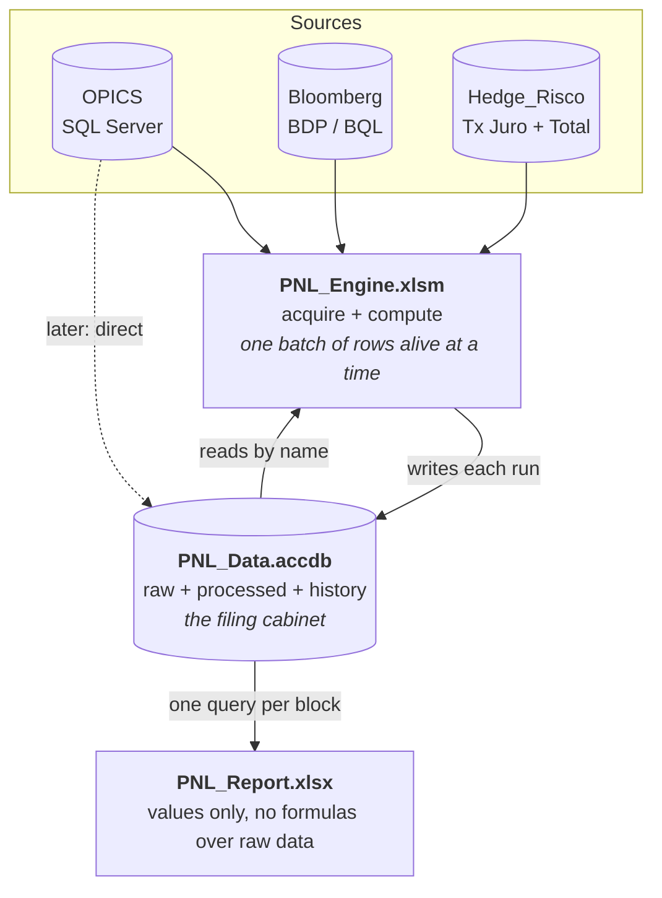

# Moving the data into Access


> **Phase 1 of this is now built and wired in.** The positions — bonds,
> swaps and futures — are stored per run, keyed so a duplicate is
> impossible, and a past run can be loaded back onto the sheets. Buttons 1
> and 2 save automatically. See **[ACCESS_STORE.md](ACCESS_STORE.md)** for
> how to set it up and operate it; this page remains the design for the
> phases that follow — computed facts, curves, Bloomberg points, and the
> memory story.

A plan for everything past that first phase.

The workbook is doing three jobs at once — acquiring data, computing on it, and
storing it — and it is the *storing* that has become expensive. Excel stores by
holding every value and every formula in RAM, addresses everything by position,
and keeps exactly one version: today's.

This document proposes moving the storage into an Access database and leaving
Excel the two jobs it is actually good at.

- [The three problems, measured](#the-three-problems-measured)
- [The constraint that shapes everything](#the-constraint-that-shapes-everything)
- [The shape](#the-shape)
- [The schema](#the-schema)
- [Wide or tall](#wide-or-tall)
- [What this has surfaced already](#what-this-has-surfaced-already)
- [How this kills the column problem](#how-this-kills-the-column-problem)
- [How this kills the memory problem](#how-this-kills-the-memory-problem)
- [History, and what it unlocks](#history-and-what-it-unlocks)
- [Making Access fast](#making-access-fast)
- [The 2 GB ceiling](#the-2-gb-ceiling)
- [Migration, in phases](#migration-in-phases)
- [What Access is not good for, and the exit](#what-access-is-not-good-for-and-the-exit)

---

## The three problems, measured

Counted from the module on this branch, not estimated.

**The column contract is 330 columns across five sheets**, every one of them
addressed by a letter constant:

| Sheet | Declared columns |
|---|---|
| `Bonds` | 89 |
| `PNL_Attribution` | 86 |
| `Swaps` | 67 |
| `OIS_Curves` | 46 |
| `Futures` | 42 |

**The workbook carries roughly 113,000 live formulas** for a 600-bond book:

| Sheet | Formulas per row | × rows | Total |
|---|---|---|---|
| `PNL_Attribution` | 86 | 600 | 51,600 |
| `Bonds` | 68 | 600 | 40,800 |
| `Futures` | 23 | 220 | 5,060 |
| `Swaps` | 22 | 200 | 4,400 |
| `OIS_Curves` | 15 | 13 | 195 |
| `Dashboard` | — | — | 10,827 |
| | | | **≈ 112,900** |

**Every bond row runs 15 whole-column aggregations over the hedge sheets** —
8 `SUMIFS`, 6 `COUNTIFS`, 1 `COUNTIF`. At 600 bonds against 220 futures and 200
swaps that is on the order of **two million cell comparisons per recalculation**,
and Excel redoes all of it every time anything changes.

The module already carries the scar:

```vba
' Rows of bond T0 BDH formulas alive on the staging sheet at once in Step 4.  Smaller =
' fewer concurrent BDH array requests held in the BLP add-in -> lower peak memory (matters
' on 32-bit Excel's 2 GB ceiling).  Reduced 50 -> 25 as part of the Step 4 OOM fix.
Private Const T0_BOND_BATCH_ROWS As Long = 25
```

That constant is a memory ceiling expressed as a magic number. It had to be
halved once already, and it will have to be halved again as the book grows.

And there is **no history at all**. Each run overwrites the last. The
`Hedge_Risco` books are overwritten in place by the desk, so what a coverage
relation said on a given morning is, today, unrecoverable.

---

## The constraint that shapes everything

**Bloomberg BDP and BQL are Excel add-in functions.** They evaluate in a live
Excel session and nowhere else. Access cannot fetch them, and no amount of
database design changes that.

So Excel does not stop being part of the pipeline. It stops being the *filing
cabinet*. The split is:

| | |
|---|---|
| **Excel acquires** | Bloomberg (only Excel can), and the two `Hedge_Risco` workbooks |
| **Excel computes** | the row-level bond maths the UDFs already do |
| **Access stores** | everything, for ever, stamped with which run produced it |
| **Access aggregates** | the hedge roll-ups that are `SUMIFS` today |
| **Excel displays** | values read back from Access |

OPICS is already SQL Server, so it can feed Access directly and skip Excel
entirely — but that is an optimisation for later, not a precondition.

---

## The shape

Three files.



**`PNL_Data.accdb`** — tables and queries only. No forms, no code. Lives on the
share beside the coverage books.

**`PNL_Engine.xlsm`** — today's workbook, slimmed. It still holds formulas, but
only for the batch it is working on. When a batch is done it goes to Access and
the sheet is cleared.

**`PNL_Report.xlsx`** — new, and thin. What the desk opens every morning. It
contains no `SUMIFS` over hedge sheets and no Bloomberg cells; it reads finished
numbers. It can open a run from three weeks ago as easily as today's.

The split can wait. Engine and Report can begin as two groups of sheets in the
one file, and separate when the memory win is wanted.

---

## The schema

Four families of table. Full DDL in [`access/schema.sql`](../access/schema.sql).

### 1 · The run spine

```
Run
  RunID            AUTOINCREMENT  PK
  RunStartedUtc    DATETIME
  RunFinishedUtc   DATETIME
  AsOfT0           DATETIME       -- Config!B5, the CURRENT reporting date
  AsOfTM1          DATETIME       -- Config!B4, the PRIOR snapshot
  RunBy            TEXT(64)
  ModuleVersion    TEXT(32)
  ExcelBitness     TEXT(8)
  Status           TEXT(16)       -- RUNNING | COMPLETE | FAILED | SUPERSEDED
  SupersedesRunID  LONG           -- a correction points at what it corrects
  Notes            LONGTEXT
```

Every fact row in the database carries a `RunID`. That single column is the
whole of the history mechanism.

> The `AsOfT0` / `AsOfTM1` naming is deliberately the *user-facing* one, not the
> workbook's inverted `CFG_T0_DATE` = `B4` = prior. The inversion stops at the
> database boundary, and the DDL says so.

### 2 · Dimensions — what a thing *is*, independent of any run

```
Instrument        ISIN PK, Name, CCY, Coupon, CouponFreq, Maturity,
                  DayCountCode, FirstSeenRunID, LastSeenRunID
Portfolio         PortfolioCode PK, AcctgCat, Description
CoverageRelation  CoverageRelationID PK, SourceBook, RCKey, CoveredISIN,
                  FirstSeenRunID, LastSeenRunID
```

`CoverageRelation` is worth pausing on. The `#RC` relation is currently a string
carried on a hedge row and reconstructed by a forward-fill on every run. As a
table it becomes a thing with an identity, a history, and a foreign key — and
"which bond does `#RC 163` cover, and has that ever changed" becomes a query
instead of an archaeology exercise.

### 3 · Raw facts — exactly as retrieved, never edited

```
Raw_OpicsBond      RunID, ISIN, Portfolio, Notional, BookVal, ...
Raw_OpicsHedge     RunID, HedgeKind, DealID, ...
Raw_CoverageRow    RunID, SourceBook, SourceRow, ColA..ColW (as text), FormulaA
Raw_BloombergPoint RunID, SecurityID, FieldName, SnapshotDate, ValueNum,
                   ValueText, Status
```

`Raw_CoverageRow` is the one that buys something you cannot have today: a
byte-for-byte copy of what the `Hedge_Risco` sheets said on the morning of the
run. Those files are overwritten in place, so this is the only way that
information ever gets kept.

`Raw_BloombergPoint` is **tall**: one row per (security, field, date), not one
column per field. Adding a Bloomberg field becomes an `INSERT`, never a schema
change and never a column move.

### 4 · Processed facts — what the model concluded

```
Fact_BondRisk        RunID, ISIN, ModDur, Convexity, SpreadDuration, DV01_EUR, ...
Fact_HedgePosition   RunID, HedgeKind, HedgeID, LinkedISIN, CoverageRelationID,
                     LinkSource, HedgeSource, Notional, DV01_EUR, PnL_EUR
Fact_PnlAttribution  RunID, ISIN, + the 86 measures
```

`Fact_HedgePosition` is the table the hedge aggregation reads. One row per hedge,
one `GROUP BY`, done once.

### 5 · Meta — the layout registry

```
Meta_Column
  ColumnID       AUTOINCREMENT PK
  TargetSheet    TEXT(32)     -- 'PNL_Attribution'
  FieldName      TEXT(64)     -- 'Bond_DV01_Current'  (matches the Access field)
  DisplayLabel   TEXT(128)    -- 'Bond BPVs'          (what row 4 shows)
  Ordinal        LONG         -- 10, 20, 30 ... gaps on purpose
  NumberFormat   TEXT(32)
  ColumnWidth    DOUBLE
  IsVisible      YESNO
  Notes          LONGTEXT
```

This is the piece that makes the rest of it worth doing. See below.

---

## Wide or tall

The one real schema decision, and the answer differs by table.

**`Fact_PnlAttribution` should be WIDE** — 86 named fields, one row per bond per
run. Access allows 255 fields, so 86 is comfortable. The measure set is stable
and already a maintained contract. Wide is faster to query, indexes properly,
and binds to a sheet in one statement.

**`Raw_BloombergPoint` should be TALL** — the vendor field set is open-ended and
sparse. A wide table would be mostly nulls and would need a schema change every
time somebody wants a new field.

**`OIS_Curves` should be TALL too**, and this one is the clearest case of the
three. The sheet lays three currencies out side by side — 46 columns holding
what is really one repeating shape:

```
Curve_Point
  RunID, CCY, CurveType, TenorLabel, TenorYears, SnapshotDate, Rate, Status
```

13 rows × 46 columns becomes one table where **adding a fourth currency is rows,
not columns** — no new constants, no new block, no widening of anything. It also
makes `InterpOIS`/`InterpGov`/`InterpSwap` a single indexed lookup rather than a
per-currency `Select Case` that resolves to a different tenor column each time.

The instinct to make everything tall (an entity-attribute-value table) should be
resisted for the attribution facts. 600 bonds × 86 measures is 51,600 rows per
run instead of 600, every query needs a `PIVOT` to be readable, and you lose the
type system — every measure becomes a `DOUBLE` in a column that also has to hold
`Attribution_Status` and `Row_Exclusion_Reason`. Tall is right for open-ended
vendor data and for a repeating shape like a curve; wrong for a fixed contract
of named measures.

---

## What this has surfaced already

Two things, from running `tools/gen_column_registry.py` against the workbook
before a line of the migration was written. Both are the same kind of problem:
**position was carrying meaning that the name was not.**

**Three columns on `OIS_Curves` are all called `Years`.** They are the EUR, USD
and GBP tenor columns at `B`, `S` and `AJ`. On a sheet that is unambiguous —
they are in different places. In a registry addressed by name, three columns
cannot share one. The generator refuses to seed until they are distinguished,
and they are now `EUR_Years` / `USD_Years` / `GBP_Years`. This is precisely the
ambiguity that the tall `Curve_Point` table removes for good.

**Two columns that read like statuses are numbers.** `Duration_Identity_Check`
sounds like an OK/REVIEW flag and is actually a residual —
`PnL_Duration_Total - (-DV01 x dy)`. `SpreadPnL_Used` sounds like a label and is
a `SWITCH` returning one of the spread PnL amounts. Typing either as text in
Access would store a number as a string and silently break every `SUM` over it.

The generator's type map is therefore checked against the formulas, not inferred
from the names, and says so in a comment. The lesson generalises: **a column's
type is not reliably guessable from its title**, and the migration is the moment
that gets found out — cheaply now, expensively later.

---

## How this kills the column problem

Today a column lives in a letter constant, and its position **is** its identity:

```vba
Private Const PCOL_PNL_FX As String = "AV"   ' col 48 = PnL_FX
```

Everything downstream is machinery to keep that honest — the `' col N` comments,
the duplicate-letter check, the gap check, the header contract, the
`CheckPnlColumns` reconciliation, and the failure mode where the constant and the
sheet disagree and every number is quietly wrong.

**All of it exists only because Excel addresses cells by position.**

Access addresses by name. `SELECT PnL_FX FROM Fact_PnlAttribution` does not care
where the column sits on any sheet, or whether it moved.

So the sheet stops being the contract and becomes a *rendering* of it:

```sql
SELECT FieldName, DisplayLabel, Ordinal, NumberFormat
FROM   Meta_Column
WHERE  TargetSheet = 'PNL_Attribution' AND IsVisible = True
ORDER  BY Ordinal
```

The Engine builds its `SELECT` list in that order, pulls the recordset, and drops
it on the sheet with one `CopyFromRecordset`. Which means:

| To do this | Today | With the registry |
|---|---|---|
| Move a column | edit the constant, fix the `' col N`, shift every letter to its right, re-run three checks, rebuild, reconcile | `UPDATE Meta_Column SET Ordinal = 145 WHERE FieldName = 'PnL_FX'` |
| Rename what the desk sees | edit `PnlLayout`, rebuild | `UPDATE Meta_Column SET DisplayLabel = ...` |
| Hide a column | delete the constant, delete the layout line, find every reference | `SET IsVisible = False` |
| Add a column | constant + layout line + shift everything right + a writer | `INSERT` a row, add the field |

Ordinals go 10, 20, 30 — gaps on purpose, so inserting between two columns needs
no renumbering at all.

**What this retires:** the `PCOL_`/`BCOL_`/`FCOL_`/`WCOL_`/`CVCOL_` constant
blocks, `PnlLayout`, `check_layout.py`'s L001/L002/L003, the header-array width
check, and `CheckPnlColumns`. Roughly 330 constants and four checkers, replaced
by one table.

`tools/gen_column_registry.py` generates the seed rows for `Meta_Column` from the
constants that exist today, so the registry starts out agreeing with the workbook
exactly rather than being hand-typed 330 times.

---

## How this kills the memory problem

Four separate wins. They are independent, and the third is the big one.

**1 · The aggregation stops being 600 formulas.**

Today each bond row carries 15 whole-column aggregations over the hedge sheets.
The same answer in Access is one statement:

```sql
SELECT LinkedISIN,
       SUM(IIF(HedgeKind='FUT' AND HedgeSource='RTJ', DV01_EUR, 0)) AS FuturesRTJ_DV01,
       SUM(IIF(HedgeKind='FUT' AND HedgeSource='RT',  DV01_EUR, 0)) AS FuturesRT_DV01,
       SUM(IIF(HedgeKind='SWAP', DV01_EUR, 0))                      AS PlainSwap_DV01,
       COUNT(*)                                                     AS Hedge_Match_Count
FROM   Fact_HedgePosition
WHERE  RunID = ?
GROUP  BY LinkedISIN
```

One indexed pass over ~420 rows, computed once and stored — against ~2,000,000
cell comparisons redone on every recalculation. This removes 51,600 formulas and,
more importantly, the dependency graph that connects every bond row to every
hedge row.

**2 · Bloomberg cells become genuinely bounded.**

`T0_BOND_BATCH_ROWS = 25` exists because BDP/BQL cells hold live subscriptions in
the add-in's own heap. With Access as the sink the loop becomes

> write a batch → wait → calculate → **push to Access** → **clear the batch** → next

so peak Bloomberg cells are `BATCH_ROWS × fields` regardless of book size. The
constant stops being a ceiling that has to be re-tuned as the book grows, and
becomes a throughput dial.

**3 · The daily-use file stops carrying formulas at all.**

A values-only sheet costs a fraction of the same grid as formulas, and it opens
without recalculating anything. The Report workbook holds no Bloomberg cells, no
cross-sheet aggregations, and no volatile UDFs.

**4 · Sheets stop being sized for the worst case.**

Ranges are written to the row count the query returned. Nothing is pre-formatted
or pre-cleared to a guard row, which is the discipline the current branch already
had to learn the hard way.

> **Honest caveat.** The Engine still has to hold a batch of Bloomberg formulas
> while it works, so *peak* memory during a run improves by the batching, not by
> the storage. The large, permanent win is in the Report file and in the
> aggregation. Anyone promising a fixed percentage before Phase 3 is measured is
> guessing.

---

## History, and what it unlocks

Facts are **immutable**. A run never updates a previous run's rows; it inserts
its own set. A correction is a new run with `SupersedesRunID` pointing at what it
corrects, so the record shows both what was said and what it was changed to —
which is the thing an auditor asks for and the thing the workbook cannot answer
today.

Queries that become possible, none of which are possible now:

| Question | Shape |
|---|---|
| This bond's unexplained residual, every day this month | `WHERE ISIN = ? AND AsOfT0 BETWEEN ? AND ?` |
| When did this bond start failing `Row_Valid`, and why | `Row_Exclusion_Reason` ordered by run |
| What changed between run 412 and 413 | self-join on `ISIN`, measure by measure |
| Which relation covered `#RC 163` in July | `CoverageRelation` history |
| What did the coverage book actually say that morning | `Raw_CoverageRow` — **unrecoverable today** |
| Has this hedge ever been attached to a different bond | `Fact_HedgePosition` by `HedgeID` over time |
| Reproduce last Tuesday's Dashboard exactly | point the Report at that `RunID` |

That last one is the one to design for from the start: the Report takes a
`RunID` parameter and defaults to the latest. Reproducing an old day then costs
nothing extra.

---

## Making Access fast

Access is fast when it is used the way it wants to be used and slow when it is
not. The specifics that matter here:

**Provider and bitness.** `Microsoft.ACE.OLEDB.12.0`, and it must match Excel's
bitness. The module already has `GetExcelBitness()`; the connection helper should
use it to produce a clear message instead of a provider-not-registered error.

```vba
"Provider=Microsoft.ACE.OLEDB.12.0;Data Source=" & path & ";Persist Security Info=False;"
```

**Hold one connection open for the whole run.** The first connection to a shared
`.accdb` creates the `.laccdb` lock file; opening and closing per query pays that
cost repeatedly and is the most common reason Access "feels slow" over a share.
Open once at the start of the run, close in the cleanup handler — the same shape
`OpenOPICS` already uses.

**Index for the access pattern, which is always "one run".**

```
Fact_PnlAttribution  (RunID, ISIN)      unique
Fact_HedgePosition   (RunID, LinkedISIN)
Fact_HedgePosition   (RunID, HedgeID)
Raw_BloombergPoint   (RunID, SecurityID, FieldName)  unique
Run                  (AsOfT0)
```

Without these Access table-scans, and a table-scan over a share is the worst case
in the whole system.

**Never `INSERT` row by row over the network.** For a few hundred rows it is
tolerable; for the raw Bloomberg points it is not. Two good options:

- Wrap the inserts in a single transaction (`BeginTrans` / `CommitTrans`). One
  round trip instead of one per row.
- Better: have Access **link** the Engine's staging sheet as a linked table and
  run one `INSERT INTO Fact_X SELECT ... FROM LinkedStaging` from the Access
  side. The whole batch moves in one statement with no row loop at all.

**Read with `CopyFromRecordset`.** One call, no loop. It is the fastest
Access → Excel path and it sizes the range for you.

**Avoid** `LIKE '%x%'`, `DISTINCT` over unindexed text, and `SELECT *` across the
share. Ask for the columns the registry says are visible and no others.

**Compact and repair on a schedule.** Access does not reclaim space on delete or
on repeated inserts; a database that is written to daily will bloat until it is
compacted. Monthly, or after any bulk delete.

---

## The 2 GB ceiling

A single `.accdb` cannot exceed **2 GB**. This is the one hard limit in the plan
and it needs stating rather than discovering.

Rough arithmetic for a 600-bond book: `Fact_PnlAttribution` at 600 rows × 86
mostly-numeric fields is on the order of half a megabyte per run; add the raw
Bloomberg points and the coverage copy and a run plausibly lands somewhere around
5–15 MB. That is **a few hundred runs** — one to two years of daily running —
before the file is in trouble. Bloat between compactions eats into it further.

So the roll-off is part of the design, not a later problem:

- `PNL_Data.accdb` — the current year. Hot, indexed, what everything reads.
- `PNL_Archive_YYYY.accdb` — one per closed year, same schema.
- A documented year-end job that moves runs across and compacts both.
- The Report reads the current file by default and can be pointed at an archive.

Keeping `Raw_BloombergPoint` only for the last N runs, and the processed facts
for ever, is a reasonable variant — the raw points are the bulk, and the
processed facts are what anybody actually asks about later.

---

## Migration, in phases

Not a rewrite. Each phase is independently useful and independently revertible,
and the first one changes nothing about how the workbook behaves.

**Phase 0 — the file and the registry.** Create `PNL_Data.accdb` from
`access/schema.sql`. Seed `Meta_Column` with `tools/gen_column_registry.py` so it
agrees with the workbook exactly. Nothing in Excel changes.

**Phase 1 — write-only shadow.** At the end of each existing run, push the
finished sheets into Access. The workbook is otherwise untouched; every button
still does what it does. This starts accumulating history *immediately*, and it
validates the schema against real data before anything depends on it. Pure
upside, no risk — if the push fails, the run has still produced what it always
did.

**Phase 2 — read the dimensions back.** `Instrument`, `Portfolio` and
`CoverageRelation` come from Access instead of being re-derived every run. Small,
and it proves the read path.

**Phase 3 — move the aggregation.** The hedge roll-ups become the `GROUP BY`
above; `PNL_Attribution`'s hedge columns are read, not computed. This is the big
memory and speed win. It is also the one to validate carefully: run a day both
ways and compare measure by measure before the old `SUMIFS` come out.

**Phase 4 — lay out from the registry.** Sheets are built from `Meta_Column`.
The letter constants and the layout checkers are deleted. Moving a column becomes
an `UPDATE`.

**Phase 5 — the thin Report.** Split the daily-use file out. Point it at a
`RunID`. This is where the desk feels the memory difference.

Phases 0 and 1 are worth doing regardless of whether the rest ever happens: they
cost nothing and they start keeping the history that is currently being thrown
away every morning.

---

## What Access is not good for, and the exit

Stating this so the choice is made with open eyes:

- **Not a Bloomberg client.** Excel stays in the pipeline for ever.
- **Not for many concurrent writers.** A handful of readers and one writer — the
  Engine — is exactly what it handles well. Several people running the Engine at
  once is not.
- **2 GB per file**, as above.
- **Sensitive to the network.** Over a slow or VPN'd share, Access can be slower
  than the workbook it replaced. Test on the real M: drive before committing to
  Phase 3, not after.
- **No real concurrency control.** If two runs ever overlap, `RunID` keeps their
  rows apart, but nothing stops them both writing.

**The exit, if it outgrows Access.** Everything above is ordinary relational
design — surrogate keys, immutable run-stamped facts, a metadata table. It ports
to SQL Server or SQLite with a change of provider string and a DDL dialect pass.
The Engine's data-access layer should therefore be one module with the
connection string in `Config`, exactly as `OpenOPICS` is today, so that swap is
an afternoon rather than a project.

Given OPICS is already SQL Server, "the exit" may simply be a schema on that
instance — in which case Access has served as the design prototype, which is a
perfectly good outcome for it.
