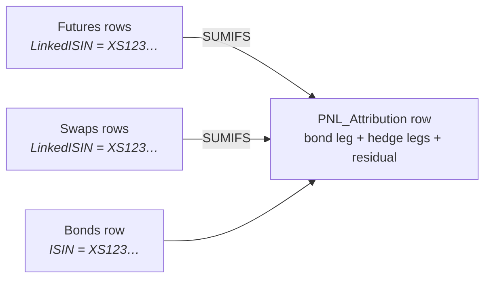

# Buttons

Three presses, left to right. Everything else is maintenance or diagnostics.

```
1  Button1_LoadBonds                 Bonds, OIS_Curves
2  Button2_LoadHedgesAndAttribute    Futures, Swaps, PNL_Attribution
3  Button3_BuildDashboard            Dashboard
```

`InstallButtons` (in `modDashboard`) puts all three on the Dashboard in run
order. It is idempotent — pressing it twice does not leave two of everything.

- [What each one does](#what-each-one-does)
- [Why there is no "write formulas" button](#why-there-is-no-write-formulas-button)
- [Why there is no "refresh market data" button](#why-there-is-no-refresh-market-data-button)
- [The Access store](#the-access-store)
- [Not buttons](#not-buttons)
- [What is gone](#what-is-gone)
- [If something looks wrong](#if-something-looks-wrong)

---

## What each one does

### 1 · `Button1_LoadBonds`

| Step | Procedure |
|---|---|
| refresh the OPICS query in place (`Bonds!A:K`) | `LoadOPICS_Bonds` |
| clear the macro columns `L:CM`, then rewrite them for exactly the rows that came back | `WriteBondFormulasSafe` |
| write the curve formulas | `WriteCurveFormulasSafe` |
| ask Bloomberg, wait for each section, `CalculateFullRebuild` | `RefreshMarketDataCore` |

The query's conditions are unchanged; this refreshes it. The macro-owned columns
are cleared and rewritten because the row count changes with the book, and a
formula block sized for last week's row count is worse than none.

Curves are written here even though they are not bond data: every bond spread on
the sheet is measured against them, and a bond formula written against an empty
curve sheet returns blank rather than wrong — which reads as "no PnL" instead of
"no curve".

Bond writers run in a fixed order. The ticker must exist before any BDP that
keys off it, and `WriteBondsCalculatedFormulas_Efficient` /
`WriteBondConvexityBumpFormulas` run last because they overwrite intermediate
columns the earlier writers fill.

---

### 2 · `Button2_LoadHedgesAndAttribute`

| Step | Procedure |
|---|---|
| load the hedge rows from both coverage books | `LoadHedges_Step2` |
| write the **futures** formulas | `WriteFuturesFormulasSafe` |
| write the **swap** formulas | `WriteSwapFormulasSafe` |
| rebuild `PNL_Attribution`, one row per bond | `WritePNLSectionSafe` |
| publish the column names the Dashboard reads | `PublishPnlColumnNames` |
| ask Bloomberg, wait, `CalculateFullRebuild` | `RefreshMarketDataCore` |

Swaps come from **Hedge_Risco Tx Juro**. Futures come from **both** Tx Juro and
**Hedge_Risco Total**, and the two are counted separately in the completion
message — a book that stopped arriving is then visible rather than netted away
inside a single total.

> **The futures formulas are not optional, and they are the half that gets
> forgotten**, because the swap leg is the one people look at. The `Futures`
> sheet carries the CTD chain, the conversion factor, the contract multiplier
> and the unit DV01. `PNL_Attribution`'s `FuturesRTJ_DV01`, `FuturesRT_DV01` and
> `Actual_Futures_PnL` are all `SUMIFS` over those columns. Skip them and the
> futures hedge reads as **zero**: a fully hedged bond looks completely
> unhedged, and its whole duration move lands in the residual.

**The attribution step is where the hedges meet the bonds.** Each row's hedge
columns are `SUMIFS` over the futures and swaps whose `LinkedISIN` is that bond:



A hedge whose `LinkedISIN` is blank, or names an ISIN not on the sheet, reaches
no row and is in no total. Two bonds carrying the same hedge ISIN each claim the
*full* hedge PnL and DV01. Both are reported on the Dashboard rather than left
to be discovered.

---

### 3 · `Button3_BuildDashboard`

`CalculateFullRebuild`, then `BuildDashboard_Step6`.

The rebuild comes first for the reason in the next section. Building on a stale
`PNL_Attribution` produces a Dashboard that is internally consistent and quietly
a day old, which is the worst of the available outcomes.

---

## Why there is no "write formulas" button

There used to be one, and pressing it was the only thing standing between a
freshly loaded book and a sheet full of blanks.

But a formula is only ever missing for one reason: **a row appeared that did not
have one yet.** The load is the moment that happens, and the only moment that
knows how many rows there now are. Splitting the two apart created a state —
rows loaded, formulas not written, or worse, formulas written for the previous
row count — that is always wrong and that the workbook could not report.

Every writer still exists and **not one of them changed**. They are called from
the button that creates the rows they fill:

| Was in `WriteAllModelFormulas` | Now runs in |
|---|---|
| `OIS_Curves` | Button 1 |
| `Bonds` | Button 1 |
| `Futures` | Button 2 |
| `Swaps` | Button 2 |
| `PNL_Attribution` | Button 2 |

---

## Why there is no "refresh market data" button

**Nothing is frozen.** The T-1 columns are BQL point-in-time queries dated from
`Config!B4`; the T0 columns are BDP. There is no captured value to refresh, no
stamp to check and no un-freeze path to get wrong. Re-running reproduces both
snapshots exactly.

Two parts of the old refresh *were* load-bearing, and both now run inside
Buttons 1 and 2 as `RefreshMarketDataCore`:

**The wait.** BDP and BQL resolve asynchronously. Recalculating straight after
asking computes the whole book against `#N/A Requesting Data` — and the result
is not an error, it is blanks, which read as a *small* PnL rather than a missing
one. The wait is per section, so a timeout names the section that did not answer.

**The full rebuild.** `InterpOIS`, `InterpGov`, `InterpSwap` and
`BondPullToParPrice` read `OIS_Curves` through the object model, not through cell
references. Excel therefore has **no dependency edge** from a curve cell to the
bonds that use it, and `Application.Calculate` leaves every one of them holding
the previous run's number — silently, and looking entirely plausible.
`Application.CalculateFullRebuild` is the only thing that re-evaluates them.

---

## The Access store

Every press of Button 1 and Button 2 also stores the run — silently, at the end,
after the load has already succeeded. It cannot fail the button that called it:
a database that is unreachable must not lose a load that worked. `Config!B44`
says what happened either way, and `Config!B42 = FALSE` turns it off.

| Macro | Use |
|---|---|
| `Access_TestConnection` | create the database and any missing objects, then report what is there |
| `Access_SaveCurrentRun` | store the three sheets as a run, now |
| `Access_ShowRunHistory` | rebuild the `Run_History` sheet — every run, newest first |
| `Access_LoadRunIntoSheets` | put a stored run back on Bonds, Swaps and Futures, and rewrite the formulas for it |
| `Access_PurgeRun` / `Access_PurgeOldRuns` | delete one run, or everything past the most recent `Config!B45` |

Saving twice with nothing changed does **not** produce two runs: the second save
fingerprints the same and is refused, returning the existing `RunID`. That is
also why Button 1 saving and then Button 2 saving minutes later is one run's
worth of history rather than two.

[SETUP_ACCESS_STORE.md](SETUP_ACCESS_STORE.md) is how to get it running;
[ACCESS_STORE.md](ACCESS_STORE.md) has the keys and the guarantees.

---

## Not buttons

| Macro | Use |
|---|---|
| `Setup_Workbook_Layout` | create or repair every sheet and its headers, and label the Access store's Config cells. Once on a new workbook, or after changing `PnlLayout` |
| `InstallButtons` | put the three buttons on the Dashboard |
| `RebuildPNLOnly` | rebuild `PNL_Attribution` without touching the data sheets |
| `AssertPNLDashboardContract` | check row 4 still matches `PnlLayout` |
| `AssertGeometryConstants` | check the letter ↔ number column bridges |
| `Test_OPICS_Connection` | connection check |
| `ValidateSwapFloatFamilies` | swap float-index sanity |
| `Refresh_CoverageSupport_And_BuildSwapMap` | rebuild the swap/futures coverage maps |
| `Debug_Dump_T0_BDH_Formulas`, `Debug_CheckSwapMapAndSwaps`, `RestoreBondMarketFormulas_Debug` | diagnostics |

`LoadOPICS_Bonds` and `LoadHedges_Step2` remain callable on their own. Both take
`silent:=True`, which is how the buttons suppress their individual message boxes
and report once at the end.

---

## What is gone

| Removed | Why | Where it went |
|---|---|---|
| `WriteAllModelFormulas` | created a state the sheet could not report | split across Buttons 1 and 2, writers unchanged |
| `RefreshMarketData` (as a button) | nothing to refresh; the wait and the rebuild are not user decisions | `RefreshMarketDataCore`, called by Buttons 1 and 2 |
| `InstallDashboardButton6` | installed one button that ran `BuildDashboard_Step6` directly, skipping the full rebuild | `InstallButtons` |
| `Refresh_BBG_T1_Step3`, `Freeze_T0_Snapshot_Step4`, `RecalculatePNL_Step5` | removed earlier — they froze formulas that were already reproducible | — |

`tools/vba_lint.py` reports 19 unreferenced private procedures in `modPNL`, all
pre-dating this work — among them `GetBondSelectQuery` and
`GetFuturesSelectQuery`, dead because bonds are now loaded through an Excel query
rather than an ADO recordset. They are left in place: removing them is a
separate decision, not a side effect of this one.

---

## If something looks wrong

| Symptom | Look at |
|---|---|
| Dashboard build stops with error 9901 | a key `modDashboard` asks for that `PnlLayout` does not declare. Run `python3 tools/check_layout.py` |
| Dashboard shows `#NAME?` everywhere | the names were never published — press Button 2 |
| A whole leg reads zero | the writer for it may be missing; `check_layout.py` fails on a declared-but-unwritten column |
| Futures hedge reads zero on every bond | Button 2 did not get as far as the futures formulas — check the completion message for a reported section |
| Numbers are plausible but a day old | something recalculated without `CalculateFullRebuild` |
| Everything blank after a run | Bloomberg was still answering; the per-section wait will have said which section |
| A bond is missing from the totals | it is quarantined — the block at the bottom of the Dashboard names it and the reason |
